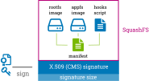
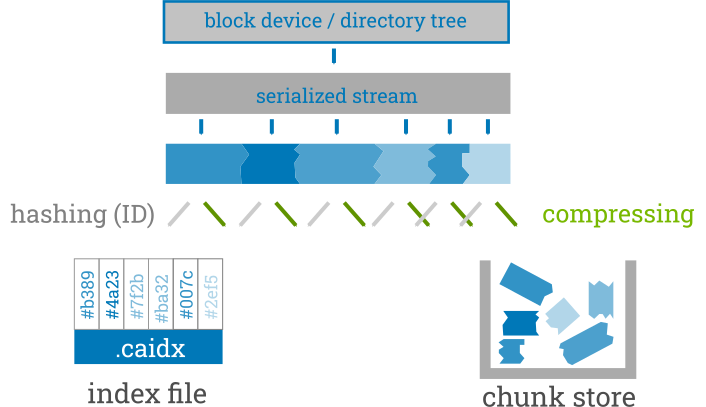
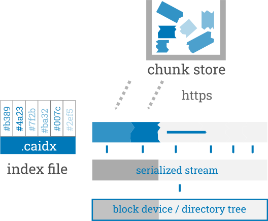
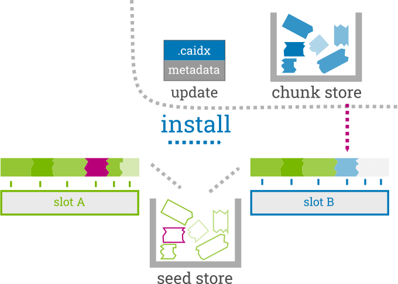
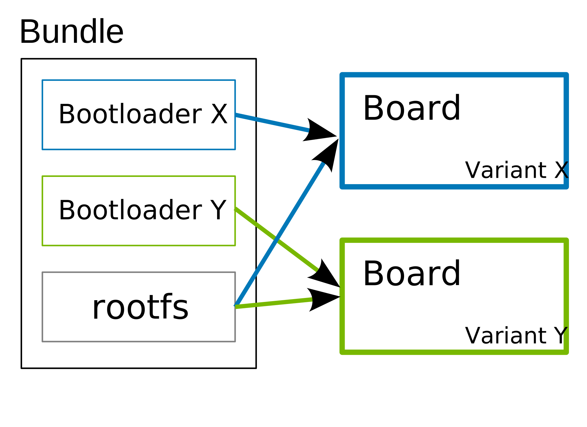
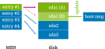
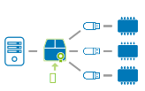
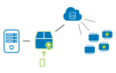

Advanced Topics
===============

.. contents::
   :local:
   :depth: 2

.. _sec-security:

Security
--------

The RAUC bundle format consists of the images and a manifest, contained in a
SquashFS image.
The SquashFS is followed by a public key signature over the full image.
The signature is stored (together with the signer's certificate) in the CMS
(Cryptographic Message Syntax, see RFC5652_) format.
Before installation, the signer certificate is verified against the keyring(s)
already stored on the system and the signer's public key is then used to verify
the bundle signature.

.. _RFC5652: https://tools.ietf.org/html/rfc5652

We selected the CMS to avoid designing and implementing our own custom security
mechanism (which often results in vulnerabilities).
CMS is well proven in S/MIME and has widely available implementations, while
supporting simple as well as complex PKI use-cases (certificate expiry,
intermediate CAs, revocation, algorithm selection, hardware security modules…)
without additional complexity in RAUC itself.
RAUC uses OpenSSL_ as a library for signing and verification of bundles.

.. _OpenSSL: https://www.openssl.org/

For RAUC's unit test, a PKI with intermediate CAs and separate sub-trees for
development and release is generated by the script
``test/openssl-ca-create.sh``.
This PKI is much more complex than what is needed for almost all use-cases, as
it is intended to exercise many different code paths in RAUC.

If you are unsure which PKI to create, carefully consider if a simple
:ref:`single key setup <sec-pki-single-key>` matches your requirements.

In the following sections, general CA configuration, some use-cases and
corresponding PKI setups are described.

.. _sec-ca-configuration:

CA Configuration
~~~~~~~~~~~~~~~~

OpenSSL uses an ``openssl.cnf`` file to define paths to use for signing, default
parameters for certificates and additional parameters to be stored during
signing.
Configuring a CA/PKI correctly (and securely) is a complex topic and obviously
exceeds the scope of this documentation.
As a starting point, the OpenSSL manual pages (especially ca_, req_, x509_,
cms_, verification-options_ and config_) and Stefan H. Holek's pki-tutorial_
are useful.
If in doubt, obtain advice from an expert.

.. _ca: https://docs.openssl.org/3.6/man1/openssl-ca/
.. _req: https://docs.openssl.org/3.6/man1/openssl-req/
.. _x509: https://docs.openssl.org/3.6/man1/openssl-x509/
.. _cms: https://docs.openssl.org/3.6/man1/openssl-cms/
.. _verification-options: https://docs.openssl.org/3.6/man1/openssl-verification-options/
.. _config: https://docs.openssl.org/3.6/man5/config/

.. _pki-tutorial: https://pki-tutorial.readthedocs.io/

.. _sec-key-usage:

Certificate Key Usage Attributes
^^^^^^^^^^^^^^^^^^^^^^^^^^^^^^^^

By default (for backwards compatibility reasons), RAUC does not check the
certificate's key usage attributes.
When not using a stand-alone PKI for RAUC, it can be useful to enable checking
via the ``check-purpose`` configuration option to allow only specific
certificates for bundle installation.

When using OpenSSL to create your certificates, the key usage attributes can be
configured in the `X.509 V3 extension sections
<https://www.openssl.org/docs/man1.1.1/man5/x509v3_config.html>`_ in your
OpenSSL configuration file.
The extension configuration section to be used by ``openssl ca`` is selected
via the ``-extensions`` argument.
For example, RAUC uses a certificate created with the following extensions to
test the handling of the *codeSigning* *extended key usage* attribute::

  [ v3_leaf_codesign ]
  subjectKeyIdentifier=hash
  authorityKeyIdentifier=keyid:always,issuer:always
  basicConstraints = CA:FALSE
  extendedKeyUsage=critical,codeSigning

As OpenSSL does not (yet) provide a purpose check for code signing, RAUC
contains its own implementation, which can be enabled with the
:ref:`check-purpose=codesign <check-purpose>` configuration option.
For the leaf (signer) certificate, the *extendedKeyUsage* attribute must exist
and contain (at least) the *codeSigning* value.
Also, if it has the *keyUsage* attribute, it must contain at least *digitalSignature*.
For all other (issuer) certificates in the chain, the *extendedKeyUsage*
attribute is optional, but if it is present, it must contain at least the
*codeSigning* value.

This means that only signatures using certificates explicitly issued for code
signing are accepted for the ``codesign`` purpose.
Also, you can optionally use *extendedKeyUsage* attributes on intermediate CA
certificates to limit which ones are allowed to issue code signing
certificates.

.. _sec-pki-single-key:

Single Key
~~~~~~~~~~

You can use ``openssl req -x509 -newkey rsa:4096 -keyout key.pem -out
cert.pem -days 365 -nodes`` to create a key and a self-signed certificate.
While you can use RAUC with these, you can't:

* replace expired certificates without updating the keyring
* distinguish between development versions and releases
* revoke a compromised key

Carefully consider the certificate's validity period in relation to your
intended update and certificate rollover cycles.

Simple CA
~~~~~~~~~

By using the (self-signed) root CA only for signing other keys, which are used
for bundle signing, you can:

* create one key per developer, with limited validity periods
* revoke keys and ship the CRL (Certificate Revocation List) with an update

With this setup, you can reduce the impact of a compromised developer key.

Separate Development and Release CAs
~~~~~~~~~~~~~~~~~~~~~~~~~~~~~~~~~~~~

By creating a complete separate CA and bundle signing keys, you can give only
specific persons (or roles) the keys necessary to sign final releases.
Each device only has one of the two CAs in its keyring, allowing only
installation of the corresponding updates.

While using signing also during development may seem unnecessary, the additional
testing of the whole update system (RAUC, bootloader, migration code, …) allows
finding problems much earlier.

Intermediate Certificates
~~~~~~~~~~~~~~~~~~~~~~~~~

RAUC allows you to include intermediate certificates in the bundle signature
that can be used to close the trust chain during bundle signature verification.

To do this, specify the ``--intermediate`` argument during bundle creation::

  rauc bundle --intermediate=/path/to/intermediate.ca.pem [...]

Note that you can specify the ``--intermediate`` argument multiple times to
include multiple intermediate certificates to your bundle signature.

Passphrase Handling
~~~~~~~~~~~~~~~~~~~

If the signing key is protected by a passphrase it has to be entered
during signing operations.
For automation purposes the passphrase can be set using the
environment variable ``RAUC_KEY_PASSPHRASE``.

.. note::
  Since the environment of other processes is visible on Linux, this
  option should be used with caution.

.. _sec-resign:

Resigning Bundles
~~~~~~~~~~~~~~~~~

RAUC allows to replace the signature of a bundle.
A typical use case for this is if a bundle that was generated by an autobuilder
and signed with a development certificate was tested successfully on your target
and should now become a release bundle.
For this it needs to be resigned with the release key without modifying
the content of the bundle itself.

This is what the ``resign`` command of RAUC is for::

  rauc resign --cert=<certfile> --key=<keyfile> --keyring=<keyring> <input-bundle> <output-bundle>

It verifies the bundle against the given keyring, strips the old signature and
attaches a new one based on the key and cert files provided.
If the old signature is no longer valid, you can use the ``--no-verify``
argument to disable verification.

Switching the Keyring -- SPKI hashes
^^^^^^^^^^^^^^^^^^^^^^^^^^^^^^^^^^^^

When switching from a development to a release signature, it is typically
required to also equip the rootfs with a different keyring file.

While the development system should accept both development and release
certificates, the release system should accept only release certificates.

One option to perform this exchange without having to build a new rootfs would
be to include both a keyring for the development case as well as a keyring for
the release case.

Doing this would be possible in a slot's post-install hook, for example.
Depending on whether the bundle to install was signed with a development or a
release certificate, either the production or development keyring will be copied
to the location where RAUC expects it to be.

To allow comparing hashes, RAUC generates SPKI hashes (i.e. hashes over the
entire public key information of a certificate) out of each signature
contained in the bundle's trust chain.
The SPKI hashes are invariant over changes in signature meta data (such as the
validity dates) while allowing to securely compare the certificate ownership.

A simple call of ``rauc info`` will list the SPKI hashes for each certificate
contained in the validated trust chain::

  Certificate Chain:
   0 Subject: /O=Test Org/CN=Test Org Release-1
     Issuer: /O=Test Org/CN=Test Org Provisioning CA Release
     SPKI sha256: 94:67:AB:31:08:04:3D:2D:62:D5:EE:58:D6:2F:86:7A:F2:77:94:29:9B:46:11:00:EC:D4:7B:1B:1D:42:8E:5A
   1 Subject: /O=Test Org/CN=Test Org Provisioning CA Release
     Issuer: /O=Test Org/CN=Test Org Provisioning CA Root
     SPKI sha256: 47:D4:9D:73:9B:11:FB:FD:AB:79:2A:07:36:B7:EF:89:3F:34:5F:D4:9B:F3:55:0F:C1:04:E7:CC:2F:32:DB:11
   2 Subject: /O=Test Org/CN=Test Org Provisioning CA Root
     Issuer: /O=Test Org/CN=Test Org Provisioning CA Root
     SPKI sha256: 00:34:F8:FE:5A:DC:3B:0D:FE:64:24:07:27:5D:14:4D:E2:39:8C:68:CC:9A:86:DD:67:03:D7:15:11:16:B4:4E

A post-install hook instead can access the SPKI hashes via the environment
variable ``RAUC_BUNDLE_SPKI_HASHES`` that will be set by RAUC when invoking the
hook script.
This variable will contain a space-separated list of the hashes in the same order
they are listed in ``rauc info``.
This list can be used to define a condition in the hook for either installing
one or the other keyring file on the target.

Example hook shell script code for above trust chain:

.. code-block:: sh

  case "$1" in

  	[...]

  	slot-post-install)

  		[...]

  		# iterate over trust chain SPKI hashes (from leaf to root)
  		for i in $RAUC_BUNDLE_SPKI_HASHES; do
  			# Test for development intermediate certificate
  			if [ "$i" == "46:9E:16:E2:DC:1E:09:F8:5B:7F:71:D5:DF:D0:A4:91:7F:FE:AD:24:7B:47:E4:37:BF:76:21:3A:38:49:89:5B" ]; then
  				echo "Activating development key chain"
  				mv "$RAUC_SLOT_MOUNT_POINT/etc/rauc/devel-keyring.pem" "$RAUC_SLOT_MOUNT_POINT/etc/rauc/keyring.pem"
  				break
  			fi
  			# Test for release intermediate certificate
  			if [ "$i" == "47:D4:9D:73:9B:11:FB:FD:AB:79:2A:07:36:B7:EF:89:3F:34:5F:D4:9B:F3:55:0F:C1:04:E7:CC:2F:32:DB:11" ]; then
  				echo "Activating release key chain"
  				mv "$RAUC_SLOT_MOUNT_POINT/etc/rauc/release-keyring.pem" "$RAUC_SLOT_MOUNT_POINT/etc/rauc/keyring.pem"
  				break
  			fi
  		done
  		;;

  	[...]
  esac

.. _pkcs11-support:

PKCS#11 Support
~~~~~~~~~~~~~~~

RAUC can use certificates and keys which are stored in a PKCS#11-supporting
smart-card, USB token (such as a `YubiKey <https://www.yubico.com>`_) or
Hardware Security Module (HSM).
For all commands which need create a signature ``bundle``, ``convert`` and
``resign``, `PKCS#11 URLs <https://tools.ietf.org/html/rfc7512>`_ can be used
instead of filenames for the ``--cert`` and ``--key`` arguments.

For example, a bundle can be signed with a certificate and key available as
``pkcs11:token=rauc;object=autobuilder-1``:

.. code-block:: console

  $ rauc bundle \
    --cert='pkcs11:token=rauc;object=autobuilder-1' \
    --key='pkcs11:token=rauc;object=autobuilder-1' \
    <input-dir> <output-file>

.. note::
  Most PKCS#11 implementations require a PIN for signing operations.
  You can either enter the PIN interactively as requested by RAUC or use the
  ``RAUC_PKCS11_PIN`` environment variable to specify the PIN to use.

When working with PKCS#11, some tools are useful to configure and show your tokens:

`p11-kit <https://github.com/p11-glue/p11-kit>`_
  p11-kit is an abstraction layer which provides access to multiple PKCS#11 modules.

`GnuTLS <https://gitlab.com/gnutls/gnutls>`_
  GnuTLS is a library implementing TLS and related functionality.
  It contains ``p11tool``, which is useful to see available tokens and objects
  (keys and certificates) and their URLs::

    $ p11tool --list-tokens
    …
    Token 5:
	    URL: pkcs11:model=SoftHSM%20v2;manufacturer=SoftHSM%20project;serial=9f03d1aaed92ef58;token=rauc
	    Label: rauc
	    Type: Generic token
	    Manufacturer: SoftHSM project
	    Model: SoftHSM v2
	    Serial: 9f03d1aaed92ef58
	    Module: /usr/lib/softhsm/libsofthsm2.so
    $ p11tool --login --list-all pkcs11:token=rauc
    Token 'rauc' with URL 'pkcs11:model=SoftHSM%20v2;manufacturer=SoftHSM%20project;serial=9f03d1aaed92ef58;token=rauc' requires user PIN
    Enter PIN: ****
    Object 0:
	    URL: pkcs11:model=SoftHSM%20v2;manufacturer=SoftHSM%20project;serial=9f03d1aaed92ef58;token=rauc;id=%01;object=autobuilder-1;type=public
	    Type: Public key
	    Label: autobuilder-1
	    Flags: CKA_WRAP/UNWRAP;
	    ID: 01

    Object 1:
	    URL: pkcs11:model=SoftHSM%20v2;manufacturer=SoftHSM%20project;serial=9f03d1aaed92ef58;token=rauc;id=%01;object=autobuilder-1;type=private
	    Type: Private key
	    Label: autobuilder-1
	    Flags: CKA_WRAP/UNWRAP; CKA_PRIVATE; CKA_SENSITIVE;
	    ID: 01

    Object 2:
	    URL: pkcs11:model=SoftHSM%20v2;manufacturer=SoftHSM%20project;serial=9f03d1aaed92ef58;token=rauc;id=%01;object=autobuilder-1;type=cert
	    Type: X.509 Certificate
	    Label: autobuilder-1
	    ID: 01

  More details are available in the `GnuTLS manual
  <https://www.gnutls.org/manual/html_node/p11tool-Invocation.html>`_.

`OpenSC <https://github.com/OpenSC/OpenSC>`_
  OpenSC is the standard open source framework for smart card access.

  It provides ``pkcs11-tool``, which is useful to prepare a token for usage
  with RAUC.
  It can list, read/write objects, generate key pairs and more.

`libp11 <https://github.com/OpenSC/libp11>`_
  libp11 is an engine plugin for OpenSSL, which allows using keys on PKCS#11
  tokens with OpenSSL.

  It will automatically use p11-kit (if available) to access all configured
  PKCS#11 modules.

  .. note::
    If you cannot use p11-kit, you can also use the ``RAUC_PKCS11_MODULE``
    environment variable to select the PKCS#11 module.

`SoftHSM2 <https://github.com/opendnssec/SoftHSMv2>`_
  SoftHSM2 is software implementation of a HSM with a PKCS#11 interface.

  It is used in the RAUC test suite to emulate a real HSM and can also be used
  to try the PKCS#11 functionality in RAUC without any hardware.
  The ``prepare_softhsm2`` pytest fixture in ``test/conftest.py`` can be used
  as an example on how to initialize SoftHSM2 token.

`aws-kms-pkcs11 <https://github.com/JackOfMostTrades/aws-kms-pkcs11>`_
  aws-kms-pkcs11 is a PKCS#11 which uses the AWS KMS as its backend.

  This allows using keys managed in AWS KMS for signing RAUC bundles:
  ``RAUC_PKCS11_MODULE=/usr/lib/x86_64-linux-gnu/pkcs11/aws_kms_pkcs11.so rauc
  bundle --cert=<certificate pem> --key='pkcs11:' <input-dir> <output-bundle>``

Protection Against Concurrent Bundle Modification
~~~~~~~~~~~~~~~~~~~~~~~~~~~~~~~~~~~~~~~~~~~~~~~~~

As the ``plain`` :ref:`bundle format <sec_ref_formats>` consists of a squashfs
image with an appended CMS signature, RAUC must check the signature before
accessing the squashfs.
If an unprivileged process can manipulate the squashfs part of the bundle after
the signature has been checked, it could use this to elevate its privileges.

The ``verity`` format is not affected by this problem, as the kernel checks the
squashfs data as it is read.

To mitigate this problem when using the ``plain`` format, RAUC will check the
bundle file for possible issues before accessing the squashfs:

* ownership or permissions that would allow other users to open it for writing
* storage on unsafe filesystems such as FUSE or NFS, where the data is supplied
  by an untrusted source (the rootfs is explicitly trusted, though)
* storage on a filesystem mounted from a block device with a non-root owner
* existing open file descriptors (via ``F_SETLEASE``)

If the check fails, RAUC will attempt to take ownership of the bundle file and
removes write permissions.
This protects against processes trying to open writable file descriptors from
this point on.
Then, the checks above a repeated before setting up the loopback device and
mounting the squashfs.
If this second check fails, RAUC will abort the installation.

If RAUC had to take ownership of the bundle, this change is not reverted after
the installation is completed.
Note that, if the original user has write access to the containing directory,
they can still delete the file.

.. _http-streaming:

HTTP Streaming
--------------

RAUC supports installing bundles directly from a HTTP(S) server, without having
to download and store the bundle locally.
Streaming works with the sub-commands ``install``, ``info`` and ``mount`` as
well as with the DBus API.

To use streaming, some prerequisites need to be fulfilled:

* make sure RAUC is built with ``-Dstreaming=true`` (which is the default)
* create bundles using the :ref:`verity format <sec_ref_format_verity>`
* host the bundle on a server which supports HTTP Range Requests
* enable NBD (network block device) support in the kernel

Some options can be configured in the :ref:`[streaming] section
<streaming-config-section>` in RAUC's ``system.conf``.

RAUC's streaming support works by creating a NBD device (instead of the
loopback device used for local bundles) and an unprivileged helper process to
convert the NBD read requests to HTTP Range Requests.
By using the `curl library <https://curl.se/libcurl/>`_, streaming
supports:

* HTTP versions 1.1 and 2
* Basic Authentication (``user:password@…``)
* HTTPS (optionally with client certificates, either file- or PKCS#11-based)
* custom HTTP headers (i.e. for bearer tokens)

When using TLS client certificates, you need to ensure that the key (or PKCS#11
token) is accessible to the streaming sandbox user.

You can configure a proxy by setting the ``http_proxy``/``https_proxy`` (`lower
case only
<https://everything.curl.dev/usingcurl/proxies#http_proxy-in-lower-case-only>`_)
environment variables, which are `handled by curl directly
<https://everything.curl.dev/usingcurl/proxies#proxy-environment-variables>`_.

Authentication
~~~~~~~~~~~~~~

To use Basic Authentication, you can add the username and password to the bundle
URL (``rauc install https//user:password@example.com/update.raucb``).

To pass HTTP headers for authentication, use the ``--http-header='HEADER:
VALUE'`` option of ``rauc install`` or set them via the ``http-headers`` options
of the :ref:`D-Bus InstallBundle
method<gdbus-method-de-pengutronix-rauc-Installer.InstallBundle>`.
This could be used for session cookies, bearer tokens or any custom headers.

For HTTPS client certificates, use the ``--tls-cert/key=PEMFILE|PKCS11-URL``
options of ``rauc install`` or the ``tls-cert/key`` options of the D-Bus
InstallBundle method.

If you need to temporarily disable verification of the server certificate, you
can use ``--tls-no-verify``.

Performance
~~~~~~~~~~~

As a rough guide, with a relatively fast network, streaming installation is
about as fast as downloading and then installing.
For example, when installing a 190MiB bundle on a STM32MP1 SoC (dual ARM
Cortex-A7) with an eMMC, streaming took 1m43s, while downloading followed by
local installation took 1m42s (13s+1m29s).

As each chunk of compressed data is only requested when needed by the
installation processes, you should expect that network connections with higher
round-trip-time (RTT) lead to longer installation times.
This can be compensated somewhat by using a HTTP/2 server, as this supports
multiplexing and better connection reuse.

.. _sec-additional-http-headers:

Additional HTTP Header Information
~~~~~~~~~~~~~~~~~~~~~~~~~~~~~~~~~~

Upon first HTTP request, RAUC can expose some additional information about the
system in HTTP headers.
This allows the receiving server to log this information or to build some
simple logic and rollout handling on it.

The actual information exposed to the server is configurable by
``send-headers`` option in the :ref:`[streaming] section
<streaming-config-section>` of ``system.conf``.

Beside some standard information, like the *boot ID*, the system's *uptime* or
the *installation transaction ID*, one can also expose custom information
provided by the ``system-info`` :ref:`handler <sec_ref_handlers>`.

.. _sec-encryption:

Bundle Encryption
-----------------

RAUC supports encrypting the bundle to one or more recipients (public keys).

The implementation of the crypt bundle format is based on the verity bundle
format (which uses Linux's dm-verity module).
It works by symmetrically encrypting the bundle payload and using
Linux's dm-crypt module to decrypt this on-demand.
The symmetric encryption key is contained in the manifest, which
itself is (asymmetrically) encrypted to a set of recipients.
Similar to the verity format, the crypt format can also be used
with HTTP streaming.

To use encryption, some prerequisites need to be fulfilled:

- create bundle using the crypt format
- enable dm-crypt support in the target's kernel
- have private key accessible on the target via path or PKCS#11-URI

Creating an encrypted bundle has two main steps:

- encrypting the payload with ``rauc bundle`` using a manifest configured for the crypt format
- encrypting the manifest with the payload encryption key for specific recipients with ``rauc encrypt``

We've separated these steps to support more flexibility regarding decryption keys.
Some possible workflows are described in :ref:`sec-encryption-workflows`.

The first step can be performed by a build system, very similar to how un-encrypted bundles are created.
RAUC generates a random key for symmetric AES-256 encryption of the bundle payload (the SquashFS).
The encrypted payload is then protected against modification with dm-verity (see the verity format for details).
The AES key is stored (*as plain text*) in the signed manifest.

The second step needs to be performed before publishing the bundle.
You need to provide (one or more) recipient certificates,
which are used to encrypt the signed manifest.
The already encrypted payload is reused unmodified.
Any of the corresponding private keys can then be used by RAUC to first decrypt the
manifest, which then contains the key needed to decrypt the (SquashFS) payload.

.. code-block:: console

   $ rauc encrypt --to=recipient-certs.pem --keyring=ca-cert.pem unencrypted-crypt-bundle.raucb encrypted-crypt-bundle.raucb

.. note::
   To encrypt for a larger number of recipients, the recipient certificates can be
   concatenated and provided as a single file in the ``--to`` argument.

   Also note that the certificates used for encryption don't need to be part of
   the signing PKI.

To inspect an encrypted bundle on your build host, you need to provide the
encryption key via the ``--key`` argument:

.. code-block:: console

   $ rauc info --key=/path/to/private-key.pem --keyring=/path/to/keyring.pem encrypted-crypt-bundle.raucb
   Compatible:     'Example Target'
   Version:        '2022.03-2'
   Description:    '(null)'
   Build:          '(null)'
   Hooks:          ''
   Bundle Format:  crypt [encrypted CMS]
     Crypt Key:    '<hidden>'
     Verity Salt:  '18bfbba9f129f97b6bca4aa0645db61feac2511fa940f8169c659601849de38a'
     Verity Hash:  '505d1d57bf9b280b88b023fb74d6a847c2fb419d70609b91460d5e42c465b6dd'
     Verity Size:  4096
     […]

Before installing an encrypted RAUC Bundle on the target, you need to configure
the location of the target's private key in the system.conf:

.. code-block:: cfg
   :emphasize-lines: 4,5

   [system]
   compatible=Example Target

   [encryption]
   key=pkcs11:token=rauc;object=private-key-1

The installation command then does not differ from the installation of an
unencrypted bundle:

.. code-block:: console

   # rauc install encrypted-bundle.raucb

.. _sec-encryption-workflows:

Encryption Key Workflows
~~~~~~~~~~~~~~~~~~~~~~~~

Shared Key
^^^^^^^^^^

All devices share a single key pair, perhaps store in the initial image
installed in the factory.

While a single key shared across all devices is simple to manage, it's
usually not feasible to revoke or replace in case it is compromised.
This means that an attacker requires access to only a single device to be able
to decrypt any further updates.

Note that this does *not* allow the attacker to bypass the bundle authentication.

Group Key
^^^^^^^^^

In this case, a group of devices (perhaps a production batch or for a single customer)
shares one key-pair.
Depending on the circumstances and impact, it might be easier to revoke or replace
it in case it is compromised, at least compared to the shared key approach.

Unique Per-Device Key
^^^^^^^^^^^^^^^^^^^^^

Each device has its own key, possibly protected using a TPM, HSM or TEE.
These keys could be generated on the device in the factory and the corresponding
public key stored in some device database.

In some scenarios, devices already have a unique key (and certificate)
for access to a server or VPN.
Depending on how these keys are configured, it may be possible to reuse
them for bundle encryption as well.

If any device key is compromised, it can be revoked and removed from the set
of recipients for the next update.
Accordingly, only the single compromised device will no longer be able to decrypt
updates.

Scalability
~~~~~~~~~~~

For each recipient specified to ``rauc encrypt``, the bundle size will increase
by a small amount (actual sizes depend on certificate metadata):

- RSA 4096: ~620 bytes
- ECC: ~250 bytes

With very large numbers of keys, this would result in bundles where the encryption overhead
becomes problematic.

To mitigate this issue, the set of keys can be split into multiple subsets, where the same
bundle is encrypted once per subset.
Then, depending on how each device's key is assigned to a subset, it would need to be provided
with the corresponding encrypted bundle.

As the encrypted payload is still the identical for each subset's bundle and only the encrypted
CMS structure (containing the signed manifest) differs, the payload needs to be stored only once.
If needed, this could be implemented in a web application or using a reflink-capable Linux filesystem.

.. _sec-data-storage:

Data Storage and Migration
--------------------------

Most systems require a location for storing configuration data such as
passwords, ssh keys or application data.
When performing an update, you have to ensure that the updated system takes
over or can access the data of the old system.

Storing Data in The Root File System
~~~~~~~~~~~~~~~~~~~~~~~~~~~~~~~~~~~~

In case of a writable root file system, it often contains additional data,
for example cryptographic material specific to the machine, or configuration
files modified by the user.
When performing the update, you have to ensure that the files you need to
preserve are copied to the target slot after having written
the system data to it.

RAUC provides support for executing *hooks* from different slot installation
stages.
For migrating data from your old rootfs to your updated rootfs,
simply specify a slot post-install hook.
Read the :ref:`Hooks <sec-hooks>` chapter on how to create one.

Using Data Partitions
~~~~~~~~~~~~~~~~~~~~~

Often, there are a couple of reasons why you don't want to or cannot store
your data inside the root file system:

* You want to keep your rootfs read-only to reduce probability of corrupting it.
* You have a non-writable rootfs such as SquashFS.
* You want to keep your data separated from the rootfs to ease setup, reset or
  recovery.

In this case you need a separate storage location for your data on a different
partition, volume or device.

If the update concept uses full redundant root file systems,
there are also good reasons for using a redundant data storage, too.
Read below about the possible impact on data migration.

To let your system access the separate storage location, it has to be mounted
into your rootfs.
Note that if you intend to store configurable system information on your data
partition, you have to map the default Linux paths (such as ``/etc/passwd``) to
your data storage.
You can do this by using:

 * symbolic links
 * bind mounts
 * an overlay file system

It depends on the amount and type of data you want to handle which option you
should choose.

Application Data Migration
~~~~~~~~~~~~~~~~~~~~~~~~~~

Both a single and a redundant data storage have their advantages and
disadvantages.
Note when storing data inside your rootfs you will have a redundant setup by
design and cannot choose.

The decision about how to set up a configuration storage and how to handle it
depends on several aspects:

* May configuration formats change over different application versions?
* Can a new application read (and convert) old data?
* Does your infrastructure allow working on possibly obsolete data?
* Enough storage to store data redundantly?
* ...

The basic advantages and disadvantages a single or a redundant setup implicate
are listed below:

+-----------+--------------------------+---------------------------+
|           | Single Data              | Redundant Data            |
+===========+==========================+===========================+
| Setup     | easy                     | assure using correct one  |
+-----------+--------------------------+---------------------------+
| Migration | no backup by default     | copy on update, migrate   |
+-----------+--------------------------+---------------------------+
| Fallback  | tricky (reconvert data?) | easy (old data!)          |
+-----------+--------------------------+---------------------------+

Managing a ``/dev/data`` Symbolic Link
^^^^^^^^^^^^^^^^^^^^^^^^^^^^^^^^^^^^^^

For redundant data partitions the active rootfs slot has to mount the correct
data partition dynamically.
For example with ubifs, a udev rule set can be used for this::

  KERNEL=="ubi[0-9]_[0-9]", PROGRAM="/usr/bin/is-parent-active %k", RESULT=="1", SYMLINK+="data"

This example first determines if ubiX_Y is a data slot with an active parent
rootfs slot by calling the script below.
Then, the current ubiX_Y partition is bound to /dev/data if the script
returned ``1`` as its output.

``/usr/bin/is-parent-active`` is a simple bash script::

  #!/bin/bash

  ROOTFS_DEV=<determine rootfs by using proc cmdline or mount>
  TEST_DEV=<obtain parent rootfs device for currently processed device (%k)>

  if [[ $ROOTFS_DEV == $TEST_DEV ]]; then
  	echo 1
  else
  	echo 0
  fi

With this you can always mount ``/dev/data`` and get the correct data slot.

.. _sec-adaptive-updates:

Adaptive Updates
----------------

We use the term *adaptive* updates explicitly to distinguish this approach from
*delta* updates.
Delta updates contain the data necessary to move from one specific version the
new version.
Adaptive updates do not need to be installed on a specific previous version.
Instead, they contain information that allows *adaptive* selection of one of
multiple methods, using data that is already available on the target system,
either from any previous version or from an interrupted installation attempt.

Adaptive updates are intended to be used together with :ref:`http-streaming`,
as this allows RAUC to download only the parts of the bundle that are actually
needed.

As the bundle itself still contains the full information, using adaptive
updates does not change the normal flow of creating, distributing and installing
bundles.
It can be considered only an optimization of download size for bundle streaming.

To enable adaptive updates during bundle creation, add
``adaptive=<method>`` to the relevant ``[image.<slot class>]`` sections of
your manifest and configure the :ref:`shared data directory <data-directory>` in
your ``system.conf``.

Currently, the only supported adaptive method is ``block-hash-index``.

.. _sec-adaptive-block-hash-index:

Block-based Adaptive Update (``block-hash-index``)
~~~~~~~~~~~~~~~~~~~~~~~~~~~~~~~~~~~~~~~~~~~~~~~~~~

This method works by creating an index file consisting of a hash for each data
block in the image and then using this to check whether the data for each block
is available locally during installation.
The index in generated when running ``rauc bundle`` and included in the bundle
together with the full image.
After installation, RAUC also stores the current index for each slot in the
:ref:`shared data directory <data-directory>`.

During installation, RAUC accesses both slots (currently active and target) of
the class to be installed and reads the stored index for each.
If no index is available for a slot (perhaps because adaptive mode was not
used for previous updates), it is generated on-demand, which will take
additional time.
Then RAUC will iterate over the hash index in the bundle and try to locate a
matching block (with the same hash) in the slots.
Each match is verified by hashing the data read from the slot, so this can be
used even with read-write filesystems.
If no match is found (because the block contains new data), it is read from
the image file in the bundle.

As this depends on random access to the image in the bundle and to the slots,
this mode works only with block devices and does not support ``.tar`` archives.

The index uses a SHA256 hash for each 4kiB block, which results in an index size
of 0.8% of the original image.
With small changes (such as updating a single package) in an ``ext4`` image, we
have seen that around 10% of the bundle size needs to be downloaded.
When indices for all slots are available on the target, the installation
duration (compared to without adaptive mode) is often similar and can be
slightly faster if the changes are small.

.. note::
   Depending on the pattern of changed locations between the images, using a
   different compression configuration for squashfs during bundle creation can
   reduce the download overhead due to large squashfs block sizes.
   For example, a 64 kiB block size can be set with
   ``--mksquashfs-args="-b 64k"``.

.. _casync-support:

RAUC casync Support
-------------------

.. note:: Make sure to use a recent casync version (e.g. from the
  `git <https://github.com/systemd/casync>`_ repository).

  Also, for using UBI support, make sure to add casync patches from
  https://github.com/systemd/casync/pull/227.

  If file system images are sufficient, also check the more lightweight
  `casync-nano <https://github.com/florolf/casync-nano>`_ tool which can be
  used as a drop-in replacement for these use cases.

  Since 1.8, RAUC also supports the alternative `desync
  <https://github.com/folbricht/desync>`_ written in Go.

  For compatibility and comparison with RAUC's built-in streaming support,
  refer to :ref:`sec-casync-vs-streaming`.

Using the Content-Addressable Data Synchronization tool `casync` for updating
embedded / IoT devices provides a couple of benefits.
By splitting and chunking the payload images into reusable pieces, casync
allows to

 * stream remote bundles to the target without occupying storage / NAND
 * minimize transferred data for an update by downloading only the delta to the
   running system
 * reduce data storage on server side by eliminating redundancy
 * good handling for CDNs due to similar chunk sizes

For a full description of the way casync works and what you can do with it,
refer to the
`blog post <http://0pointer.net/blog/casync-a-tool-for-distributing-file-system-images.html>`_
by its author Lennart Poettering or visit the
`GitHub site <https://github.com/systemd/casync>`_.

RAUC supports using casync index files instead of complete images in its bundles.
This way the real size of the bundle comes down to the size of the index files
required for referring to the individual chunks.
The real image data contained in the individual chunks can be stored in one
single repository, for a whole systems with multiple images as well as for
multiple systems in different versions, etc.
This makes the approach quite flexible.

.. _sec-casync-vs-streaming:

casync vs. RAUC Built-in Streaming & Adaptive Updates
~~~~~~~~~~~~~~~~~~~~~~~~~~~~~~~~~~~~~~~~~~~~~~~~~~~~~

Until RAUC 1.6, using 'casync' was the only method to update over the network
without intermediate bundle storage and to reduce the download size.

Since v1.6, RAUC comes with built-in streaming support for the ``verity`` and
``crypt`` bundle formats.
This supports streaming the bundle content (images) directly into the target
slots without the need of intermediate storage.

In RAUC 1.8, 'adaptive updates' were added that provide a built-in mechanism
for reducing download size.

Both casync support and built-in HTTP(S) streaming & adaptive updates will be
supported in parallel for now.

.. note:: Currently, the only adaptive update mode supported is
   ``block-hash-index`` which works for block devices only (not file-based)

The main differences between casync and the built-in streaming with adaptive
updates are:

* casync requires bundle conversion and a separate sever-side chunk store
  while streaming adaptive updates is a fully transparent process (except that
  it requires the server to support HTTP range requests)
* casync supports chunk-based differential updates for both block-based and
  file/directory-based updates while adaptive updates currently only support
  block-based updates
* adaptive updates potentially allow the installation process to
  choose the optimal installation method out of multiple available

.. note::

  If streaming support is enabled, RAUC will **not** be able to download
  ``plain`` casync bundles anymore! An attempt will fail with::

     Bundle format 'plain' not supported in streaming mode

  The possible solutions to this are:

    a) migrate to the ``verity`` bundle format if possible, or
    b) disable streaming support by calling ``meson setup`` with
       ``-Dstreaming=false``.

Creating casync Bundles
~~~~~~~~~~~~~~~~~~~~~~~

Creating RAUC bundles with casync index files is a bit different from creating
'conventional' bundles.
While the bundle format remains the same and you could also mix conventional
and casync-based bundles, creating these bundles is not straight forward when
using common embedded build systems such as Yocto, PTXdist or buildroot.

Because of this, we decided use a two-step process for creating casync RAUC
bundles:

 1. Create 'conventional' RAUC bundle
 2. Convert to casync-based RAUC bundle

RAUC provides a command for creating casync-based bundles from  'conventional'
bundles.
Simply call::

  rauc convert --cert=<certfile> --key=<keyfile> --keyring=<keyring> conventional-bundle.raucb casync-bundle.raucb

The conversion process will create two new files:

 1. The converted bundle `casync-bundle.raucb` with casync index files instead
    of image files
 2. A casync chunk store `casync-bundle.castr/` for all bundle images.
    This is a directory with chunks grouped by subfolders of the first 4 digits
    of their chunk ID.

.. note:: In case one or several of the images in the original bundle should
   not be converted to casync images (``.caidx`` or ``.caibx``), you can
   explicitly skip them during conversion using the ``--ignore-image`` argument
   of ``rauc convert``. E.g.:

     rauc convert --ignore-image=kernel --ignore-image=dtb ...

Installing casync Bundles
~~~~~~~~~~~~~~~~~~~~~~~~~

The main difference between installing conventional bundles and bundles that
contain casync index files is that RAUC requires access to the remote casync
chunk store during installation of the bundle.

Due to the built-in network support of both casync and RAUC, it is possible to
directly give a network URL as the source of the bundle::

  rauc install https://server.example.com/deploy/bundle-20180112.raucb

By default, RAUC will assume the corresponding casync chunk store is located at
the same location as the bundle (with the ``.castr`` extension instead of
``.raucb``), in this example at
``https://server.example.com/deploy/bundle-20180112.castr``.
The default location can also be configured in the system config to point to a
generic location that is valid for all installations.

When installing a bundle, the casync implementation will automatically handle
the chunk download via an unprivileged helper binary.

Reducing Download Size -- Seeding
^^^^^^^^^^^^^^^^^^^^^^^^^^^^^^^^^

Reducing the amount of data to be transferred over slow connections is one of
the main goals of using casync for updating.
Casync splits up the images or directory trees it handles into reusable chunks
of similar size.
Doing this both on the source as well as on the destination side allows
comparing the hashes of the resulting chunks to know which parts are different.

When we update a system, we usually do not change its entire file tree, but
only update a few libraries, the kernel, the application, etc.
Thus, most of the data can be retrieved from the currently active system and
does not need to be fetched via the network.

For each casync image that RAUC extracts to the target slot, it determines an
appropriate seed.
This is normally a redundant slot of the same class as the target slot but from
the currently booted slot group.

.. note::
  Depending on your targets processing and storage speed, updating slots with
  casync can be a bit slower than conventional updates,
  because casync first has to process the entire seed slot to calculate the
  seed chunks.
  After this is done it will start writing the data and fetch missing chunks
  via the network.

.. _sec-variants:

Handling Board Variants With a Single Bundle
--------------------------------------------

If you have hardware variants that require installing different images
(e.g. for the kernel or for an FPGA bitstream), but have other slots
that are common (such as the rootfs) between all hardware variants,
RAUC allows you to put multiple different variants of these images in the
same bundle.
RAUC calls this feature 'image variants'.

If you want to make use of image variants, you first of all need to say which
variant your specific board is.
You can do this in your ``system.conf`` by setting exactly one of the keys
``variant-dtb``, ``variant-file`` or ``variant-name``.

.. code-block:: cfg

  [system]
  ...
  variant-dtb=true

The ``variant-dtb`` is a Boolean that allows (on device-tree based boards)
to use the systems compatible string as the board variant.

.. code-block:: cfg

  [system]
  ...
  variant-file=/path/to/file

A more generic alternative is the ``variant-file`` key.
It allows to specify a file that will be read to obtain the variant name.
Note that the content of the file should be a simple string without any line
breaks.
A typical use case would be to generate this file (in ``/run``) during system
startup from a value you obtained from your bootloader.
Another use case is to have a RAUC post-install hook that copies this file from
the old system to the newly updated one.

.. code-block:: cfg

  [system]
  ...
  variant-name=myvariant-name

A third variant to specify the systems variant is to give it directly in your
system.conf.
This method is primary meant for testing, as this prevents having a generic
rootfs image for all variants!

In your manifest, you can specify variants of an image (e.g. the kernel here) as
follows:

.. code-block:: cfg

  [image.kernel.variant-1]
  filename=variant1.img
  ...

  [image.kernel.variant-2]
  filename=variant1.img
  ...

It is allowed to have both a specific variant as well as a default image in the
same bundle.
If a specific variant of the image is available, it will be used on that system.
On all other systems, the default image will be used instead.

If you have a specific image variant for one of your systems,
it is mandatory to also have a default or specific variant for the same slot
class for any other system you intend to update.
RAUC will report an error if for example a bootloader image is only present for
variant A when you try to install on variant B.
This should prevent bricking your device by unintentional partial updates.

.. _sec-manual-write:

Manually Writing Images to Slots
--------------------------------

In order to write an image to a slot without using update mechanics like hooks,
slot status etc. use:

.. code-block:: console

  # rauc write-slot <slotname> <image>

This uses the correct handler to write the image to the slot.
It is useful for development scenarios as well as initial provisioning of
embedded boards.

.. _sec-advanced-updating-bootloader:

Updating the Bootloader
-----------------------

Updating the bootloader is a special case, as it is a single point of failure on
most systems:
The selection of which redundant system images should be booted cannot
itself be implemented in a redundant component (otherwise there would need to
be an even earlier selection component).

Some SoCs contain a fixed firmware or ROM code which already supports redundant
bootloaders, possibly integrated with a HW watchdog or boot counter.
On these platforms, it is possible to have the selection point before the
bootloader, allowing it to be stored redundantly and updated as any other
component.

If redundant bootloaders with fallback is not possible (or too inflexible) on
your platform, you may instead be able to ensure that the bootloader update is
atomic.
This doesn't support recovering from a buggy bootloader, but will prevent a
non-bootable system caused by an error or power-loss during the update.

Whether atomic bootloader updates can be implemented depends on your
SoC/firmware and storage medium.

.. note::

  Most bootloaders need some space to persistently store the state of the
  fallback logic.
  This storage is also normally accessed by RAUC to communicate with the
  bootloader during update installation and after successful boots.
  Some bootloaders use an *environment* file or partitions for this (for
  example GRUB's ``grubenv`` file or U-Boot's ``saveenv`` command), others have
  specialized mechanisms (Barebox's `state framework
  <https://barebox.org/doc/latest/user/state.html>`_)

  If the bootloader should be updateable, this storage space **must be outside
  of the bootloader partition**, as it would otherwise be overwritten by an
  update.
  More generally, the bootloader partition should **only** be written to when
  updating the bootloader, so it should not contain anything else that should
  be written separately (such as bootloader env, kernel or
  initramfs).

.. _sec-emmc-boot:

Update Bootloader in eMMC Boot Partitions
~~~~~~~~~~~~~~~~~~~~~~~~~~~~~~~~~~~~~~~~~

RAUC supports updating a bootloader in eMMC boot partitions (see the section `6.3.2 boot
partition` in JEDEC standard JESD84-B51_ for details), one of which can be
enabled atomically via configuration registers in the eMMC (*ext_csd
registers*).
These partitions are accessible under Linux as ``/dev/mmcblk*boot[01]``.

.. _JESD84-B51: http://www.jedec.org/standards-documents/results/jesd84-b51

.. image:: images/emmc-bootloader-update.svg
  :width: 400
  :align: center

The required slot type is ``boot-emmc``.
The device to be specified is expected to be the root device.
The corresponding boot partitions are derived automatically.
A ``system.conf`` could look like this:

.. code-block:: cfg

  [slot.bootloader.0]
  device=/dev/mmcblk1
  type=boot-emmc

.. important::

  Some kernel versions have bugs that prevent reliable use of the eMMC Extended CSD
  boot partition config register:

  * do not use kernels v6.8…v6.8.2, v6.7.3…v6.7.11, v6.6.15…v6.6.23,
    v6.1.76…v6.1.83, v5.15.149…v5.15.153, v5.10.210…v5.10.214,
    v5.4.269…v5.4.273, as these have a `bug related to uninitialized memory
    <https://github.com/rauc/rauc/discussions/1363>`_.
  * do not use kernels <v4.16, <v4.15.14 or <v4.14.31, as these don't contain an
    `important register cache fix
    <https://lore.kernel.org/all/20180308140811.6966-1-bst@pengutronix.de/>`_.

.. _sec-mbr-partition:

Update Bootloader Partition in MBR
~~~~~~~~~~~~~~~~~~~~~~~~~~~~~~~~~~

Some SoCs (like Xilinx ZynqMP) contain a fixed ROM code, which boots from the
first partition in the MBR partition table of a storage medium.
In order to atomically update the bootloader of such systems, RAUC supports
modifying the MBR to switch the actual location of the first partition
between the first and second halves of a pre-defined disk region.
The active half of the region is the one currently referenced by the MBR's
first partition entry (i.e. the first partition) while the inactive half is
not referenced by the MBR at all.
A Bootloader update is written into the currently inactive half of the region.
After having written the bootloader, RAUC modifies the MBR's first partition
entry to point to the formerly inactive half.

The disk region for the MBR bootloader partition switch has to be configured
in the corresponding slot's system config section (see below).
This configured disk region must span *both* potential locations of the
bootloader partition, i.e. both the first and second halves mentioned above.
The initial MBR must define a bootloader partition at either the first or the second
half of the configured region.

Consider the following example layout of a storage medium with a bootloader
partition size of 32 MiB:

+-----------------------+----------------+--------------------------------------------+
| Start…End             | Size           |                                            |
+=======================+================+============================================+
| 0x0000000…0x00001ff   |  512 bytes     | MBR                                        |
+-----------------------+----------------+--------------------------------------------+
| 0x0000200…0x00fffff   |  almost 1MiB   | alignment, state, barebox-environment, …   |
+-----------------------+----------------+--------------------------------------------+
| | 0x0100000…0x40fffff | | 64 MiB       | | MBR switch region containing:            |
| | 0x0100000…0x20fffff | | 32 MiB       | | - active first half (entry in MBR)       |
| | 0x2100000…0x40fffff | | 32 MiB       | | - inactive second half (no entry in MBR) |
+-----------------------+----------------+--------------------------------------------+
| 0x4100000…            | Remaining size | other partitions                           |
|                       |                | (partition table entries 2, 3, 4)          |
+-----------------------+----------------+--------------------------------------------+

RAUC uses the start address and size defined in the first entry of the MBR partition
table to detect whether the first or second half is currently active as the
bootloader partition and updates the hidden, other half:
After the update, the bootloader is switched by changing the first partition entry
and writing the whole MBR (512 bytes) atomically.

The required slot type is ``boot-mbr-switch``.
The device to be specified is the **underlying block device** (not the bootloader
partition!), as the MBR itself is outside of the region.
The region containing both halves is configured using ``region-start`` and
``region-size``.
Both values have to be set in integer decimal bytes and can be post-fixed with
K/M/G/T.

A ``system.conf`` section for the example above could look like this:

.. code-block:: cfg

  [slot.bootloader.0]
  device=/dev/mmcblk1
  type=boot-mbr-switch
  region-start=1048576
  region-size=64M

It defines a region starting at ``0x100000`` with a size of ``64M``.
This region will be split up into two region halves of equal size by RAUC
internally.
The resulting first half begins at the start of the region, i.e.
``0x100000``, and has a size of ``32M``.
The second half begins in the middle of the region (``0x100000 + 32M =
0x2100000``) and ends at the end of the defined region.
The MBR's bootloader partition entry should initially point to ``0x100000``, with a
size of ``32M``.
This must be followed by a "hole" with a size of ``32MB`` before the start of
the next partition entry (at ``0x4100000``).

.. _sec-gpt-partition:

Update Bootloader Partition in GPT
~~~~~~~~~~~~~~~~~~~~~~~~~~~~~~~~~~

Systems booting via UEFI have a special partition, called the *EFI system
partition (ESP)*, which contains the bootloader to be started by the UEFI
firmware.
Also, some newer ARM SoCs support loading the bootloader directly from a GPT
partition.

To allow atomic updates of these partitions, RAUC supports changing the GPT to
switch the first GPT partition entry between the first and second halves of a
region configured for that purpose.
This works similarly to the handling of a MBR bootloader partition entry as
described in the previous section.
It requires RAUC to be compiled with GPT support (``meson setup -Dgpt=enabled build``)
and adds a dependency on libfdisk.

The required slot type is ``boot-gpt-switch``.
The device to be specified is expected to be the underlying block device (not a
partition).
The bootloader partitions are derived by the definition of the values
``region-start`` and ``region-size``.
Both values have to be set in integer decimal bytes and can be post-fixed with
K/M/G/T.

To ensure that the resulting GPT entries are well aligned, the region start must
be a multiple of the *grain* value (as used by ``sfdisk``), which is 1MB by
default.
Accordingly, the region size must be aligned to twice the *grain* value (to
ensure that the start of the second half is aligned as well).

Note that RAUC expects that the partition table always points exactly to one of
the halves.

A ``system.conf`` section could look like this:

.. code-block:: cfg

  [slot.esp.0]
  device=/dev/sda
  type=boot-gpt-switch
  region-start=1M
  region-size=64M

.. _sec-raw-partition-fallback:

Update Raw Bootloader Partition with Fallback
~~~~~~~~~~~~~~~~~~~~~~~~~~~~~~~~~~~~~~~~~~~~~

Some SoCs (like the Rockchip RK3568) contain a fixed ROM code that searches the
possible boot media for valid images in a defined order.
Usually this happens at two or more fixed addresses ("locations").
Special headers, magic numbers, checksums, or a combination of these may be used
to determine if a valid image exists at such an address.

This behavior can be used to implement an atomic update of a bootloader.
To do this, the bootloader, which starts with the required header, is
installed in two locations that the ROM code searches for possible bootloader
images.
For example, usually only the code in the first location is used, and the second
is redundant and ignored.
During an update, the currently unused location is updated first, and followed
by the other location (which was likely just booted from).
It is important that the corresponding header is always deleted first, then the
bootloader image is written and the header is only written last.
This ensures that there is always a valid image in either location and that
half-written images are not attempted to boot from.

The required slot type is ``boot-raw-fallback``.
The device to be specified is expected to be the underlying block device.
The location of each copy in the boot region is derived from the values
``region-start`` and ``region-size``.
Both values have to be set in integer decimal bytes and can be post-fixed with
K/M/G/T.

A ``system.conf`` section could look like this:

.. code-block:: cfg

  [slot.bootloader.0]
  device=/dev/mmcblk0
  type=boot-raw-fallback
  region-start=32k
  region-size=4M

It defines a region starting at ``0x8000`` with a size of ``4M``.
This region will be split up into two halves of equal size by RAUC internally.
This results in two halves, one starting at ``0x8000`` and one at ``0x208000``,
both with a size of ``2M``.
The first half is the location where the normally used bootloader should be
stored and the second defines the location of the fallback location.
The header size is currently fixed to 512 bytes.

Since the implementation makes certain assumptions, it is important that the
SoC ROM code tries to boot from the first location first.
Note that under most circumstances the update will appear to work fine even if
the two locations are swapped.
However, for the update to actually be failsafe, the locations must be searched
in order by SoC ROM code.

Bootloader Update Ideas
~~~~~~~~~~~~~~~~~~~~~~~

The NXP i.MX6 supports up to four bootloader copies when booting from NAND
flash.
The ROM code will try each copy in turn until it finds one which is readable
without uncorrectable ECC errors and has a correct header.
By using the trait of NAND flash that interrupted writes cause ECC errors and
writing the first page (containing the header) last, the bootloader images can
be replaced one after the other, while ensuring that the system will boot even in
case of a crash or power failure.

The slot type could be called "boot-imx6-nand" analogous to eMMC.

Considerations When Updating the Bootloader
~~~~~~~~~~~~~~~~~~~~~~~~~~~~~~~~~~~~~~~~~~~

Booting an old system with a new bootloader is usually not tested during
development, increasing the risk of problems appearing only in the field.
If you want to address this issue do not add the bootloader to your bundle, but
rather use an approach like this:

* Store a copy of the bootloader in the rootfs.
* Use RAUC only to update the rootfs. The combinations to test
  can be reduced by limiting which old versions are supported by an update.
* Reboot into the new system.
* On boot, before starting the application, check that the current slot
  is 'sane'.
  Then check if the installed bootloader is older than the version shipped in
  the (new) rootfs.
  In that case:

  * Disable the old rootfs slot and update the bootloader.
  * Reboot
* Start the application.

This way you still have fallback support for the rootfs upgrade and need
to test only:

* The sanity check functionality and the bootloader installation when started
  from old bootloader and new rootfs
* Normal operation when started from new bootloader and new rootfs

The case of new bootloader with old rootfs can never happen, because you
disable the old one from the new before installing a new bootloader.

If you need to ensure that you can fall back to the secondary slot even after
performing the bootloader update, you should check that the "other" slot
contains the same bootloader version as the currently running one during the
sanity check.
This means that you need to update both slots in turn before the bootloader is
updated.

Updating Sub-Devices
--------------------

Besides the internal storage, some systems have external components or
sub-devices which can be updated.
For example:

* Firmware for micro-controllers on modular boards
* Firmware for a system management controller
* FPGA bitstreams (stored in a separate flash)
* Other Linux-based systems in the same enclosure
* Software for third-party hardware components

In many cases, these components have some custom interface to query the
currently installed version and to upload an update.
They may or may not have internal redundancy or recovery mechanisms as well.

Although it is possible to configure RAUC slots for these and let it call a
script to perform the installation, there are some disadvantages to this
approach:

* After a fallback to an older version in an A/B scenario, the sub-devices may be
  running an incompatible (newer) version.
* A modular sub-device may be replaced and still has an old firmware version
  installed.
* The number of sub-devices may not be fixed, so each device would need a
  different slot configuration.

Instead, a more robust approach is to store the sub-device firmware in the
rootfs and (if needed) update them to the current versions during boot.
This ensures that the sub-devices are always running the correct set of versions
corresponding to the version of the main application.

If the bootloader falls back to the previous version on the main system, the
same mechanism will downgrade the sub-devices as needed.
During a downgrade, sub-devices which are running Linux with RAUC in an A/B
scenario will detect that the image to be installed already matches the one in
the other slot and avoid unnecessary installations.

.. _sec_migrate_updated_bundle_version:

Migrating to an Updated Bundle Version
--------------------------------------

As RAUC undergoes constant development, it might be extended and new
features or enhancements will make their way into RAUC.
Thus, also the sections and options contained in the bundle manifest may be
extended over time.

To assure a well-defined and controlled update procedure,
RAUC is rather strict in parsing the manifest and will reject bundles
containing unknown configuration options.

But, this does not prevent you from being able to use those new RAUC features
on your current system.
All you have to do is to perform an *intermediate update*:

* Create a bundle containing a rootfs with the recent RAUC version,
  but *not* containing the new RAUC features in its manifest.
* Update the target system and reboot.
* Now you have a target system with a recent RAUC version which is able to
  interpret and appropriately handle a bundle with the latest options.

Software Deployment
-------------------

When designing your update infrastructure, you must think about how to deploy
the updates to your device(s).
In general, you have two major options:
Deployment via storage media such as USB sticks or network-based deployment.

As RAUC uses signed bundles instead of e.g. trusted connections to enable update
author verification, RAUC fully supports both methods with the same technique
and you may also use both of them in parallel.

Some influential factors on the method to used can be:

* Do you have network access on the device?
* How many devices have to be updated?
* Who will perform the update?

Deployment via Storage Media
~~~~~~~~~~~~~~~~~~~~~~~~~~~~

This method is mainly used for decentralized updates of devices without network
access (either due to missing infrastructure or because of security concerns).

To handle deployment via storage media, you need a component that detects the
plugged-in storage media and calls RAUC to trigger the actual installation.

When using systemd, you could use automount_ units for detecting plugged-in
media and trigger an installation.

.. _automount: https://www.freedesktop.org/software/systemd/man/systemd.automount.html

Deployment via Deployment Server
~~~~~~~~~~~~~~~~~~~~~~~~~~~~~~~~

Deployment over a network is especially useful when having a larger set of
devices to update or direct access to these devices is tricky.

As RAUC focuses on update handling on the target side, it does not provide a
deployment server out of the box.
But if you do not already have a deployment infrastructure, there a few Open
Source deployment server implementations available in the wilderness.

One such service worth being mentioned is
`hawkBit <https://eclipse.org/hawkbit/>`_ from the Eclipse IoT project, which
also provides some strategies for rollout management for larger-scale device
farms.

RAUC hawkBit Updater (C)
^^^^^^^^^^^^^^^^^^^^^^^^

The rauc-hawkbit-updater is a separate application project developed under the
RAUC organization umbrella.
It aims to provide a ready-to-use bridge between the hawkBit REST DDR API on
one side and the RAUC D-Bus API on the other.

For more information visit it on GitHub:

https://github.com/rauc/rauc-hawkbit-updater

The RAUC hawkBit Client (python)
^^^^^^^^^^^^^^^^^^^^^^^^^^^^^^^^

As a separate project, the RAUC development team provides a Python-based
example application that acts as a hawkBit client via its REST DDI-API while
controlling RAUC via D-Bus.

For more information visit it on GitHub:

https://github.com/rauc/rauc-hawkbit

It is also available via PyPI:

https://pypi.python.org/pypi/rauc-hawkbit/

Upparat: Client for AWS IoT Jobs (python)
^^^^^^^^^^^^^^^^^^^^^^^^^^^^^^^^^^^^^^^^^

Upparat acts as a client for `AWS IoT Jobs <https://docs.aws.amazon.com/iot/latest/developerguide/iot-jobs.html>`_ that can be used together with RAUC.

For more information visit it on GitHub:

https://github.com/caruhome/upparat

It is also available via PyPI:

https://pypi.org/project/upparat/

qbee: Fleet Management with Support for RAUC
^^^^^^^^^^^^^^^^^^^^^^^^^^^^^^^^^^^^^^^^^^^^

qbee offers a fleet management service with an `Open Source agent
<https://github.com/qbee-io/qbee-agent>`_ which supports using RAUC with
streaming to perform OTA updates.

For more information visit the documentation:

https://qbee.io/docs/update-ota-image.html

AWS IoT Greengrass
^^^^^^^^^^^^^^^^^^

AWS `IoT Greengrass <https://docs.aws.amazon.com/greengrass/v2/developerguide/greengrass-nucleus-lite-component.html>`_ is an edge runtime, that allows customers to develop and deploy their own components.

One component could also be a rauc updater component as shown `here <https://github.com/aws4embeddedlinux/meta-aws-demos/blob/master/meta-aws-demos/recipes-core/images/aws-iot-greengrass-lite-demo-image/README.md#demo-ab-update-greengrass-component>`_

.. _sec-advanced-event-log:

Installation History and Event Logging
--------------------------------------

.. note::
   We don't consider the details of the new log events fixed yet, so please use
   them as a preview and for testing.
   In a future release, they will be documented in a `journald message catalog
   <https://www.freedesktop.org/wiki/Software/systemd/catalog/>`_.

Even if RAUC mainly focuses on logging information to stdout or into the
journal (when using systemd), this might be insufficient for some purposes and
especially for keeping long-term history of what RAUC changed on the system.

A common problem for example can be journal rotation.
Since storage is limited and the journal contains a lot of other information,
it needs to be rotated at some point.
However, one might want to preserve the history of what RAUC installed on the
system or when the system rebooted, went into fallback, etc. for very long or
even the full life time of the device.

Another motivation can be to have a clearly separated distinct log location
where other system components or a service technician (that should not have
access to the whole system) should have a look into.

The RAUC 'event logging' handling targets these and other cases.
It defines a distinct set of events that might be of interest for later
introspection, debugging or informative output.

Via RAUC's ``system.conf`` one or several loggers can be configured with
selectable output format, event filters, and also basic log rotation is
supported.

A new logger can be registered with adding a ``log.<loggername>`` section to
the ``system.conf``.

To have e.g. an unlimited human-readable short log of the installations
happened on the system, use::

  [log.install-log]
  filename=install.log
  events=install
  format=short

Or, if you want a json-based log of all events, limited to 1M per log file and
5 rotation files to keep, use::

  [log.all-json-log]
  filename=all-json.log
  format=json
  max-size=1M
  max-files=5

If an error occurs during logging (such as disk full or write errors), that
logger is marked as broken and no longer used.
An ongoing installation is **not** aborted.

For a full reference of supported configuration options, see
:ref:`logger sections reference <ref-logger-sections>`.

.. note:: All events logged using the internal event logging framework will
   also be forwarded to the default logger and thus be visible e.g. in the
   journal (when using systemd).
