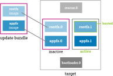
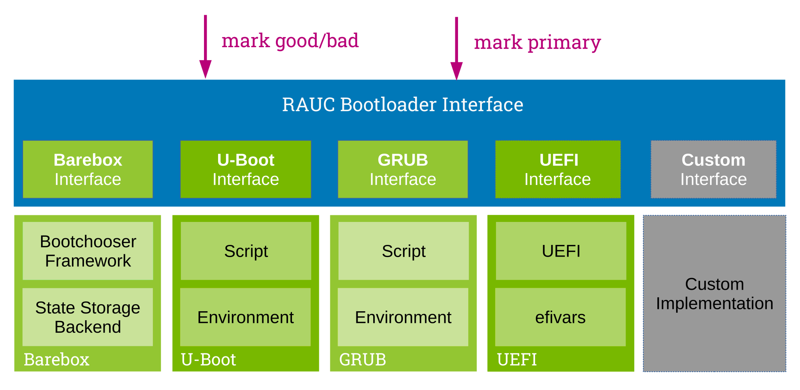
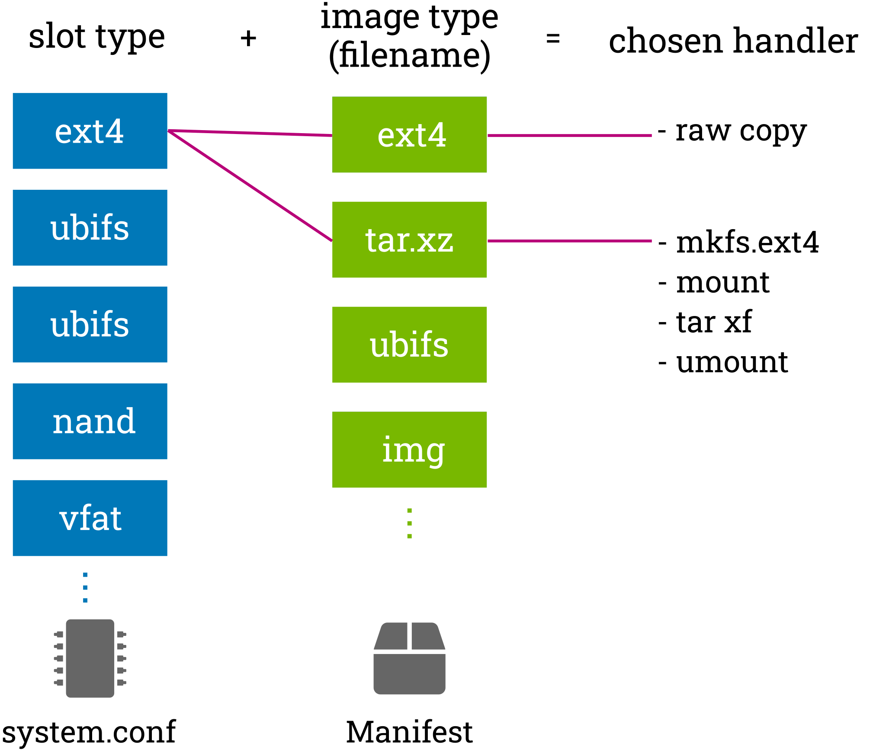

RAUC Basics
===========

From a top view, the RAUC update framework provides a solution for four basic
tasks:

* generating the update bundles
* signing and verification of update bundles
* robust installation of the payload(s)
* interfacing with the boot process

RAUC is basically an image-based updater, i.e. it installs file images on
devices or partitions.
But, for target devices that can have a file system, it also supports
installing contents from tar archives.
This often provides much more flexibility as a tar archive does not have to fit a
specific partition size or type.
RAUC ensures that the target file system will be set up correctly before
unpacking the archive.

Update Bundles
---------------

In order to know how to pack multiple file system images, properly handle
installation, check target system compatibility and for other meta-information
RAUC uses its own update file format, simply referred to as a *bundle* in the
following.

A RAUC bundle consists of the file system image(s) or archive(s) to be installed
on the system, a *manifest* that lists the images to install and contains
options and meta-information, and possible scripts to run before, during or
after installation.
A bundle may also contain files not referenced in the manifest,
such as scripts or archives that are referenced by files that *are*
included in the manifest.

To pack this all together, these contents are collected into a SquashFS image.
This provides good compression while allowing to mount the bundle without
having to unpack it on the target system.
This way, no additional intermediate storage is required.
For more details see the :ref:`sec_ref_formats` section.

A key design decision of RAUC is that signing a bundle is mandatory.
For development purpose a self-signed certificate might be sufficient,
for production the signing process should be integrated with your PKI
infrastructure.
Read the :ref:`sec-security` chapter for more details on signing bundles.

.. important:: A RAUC Bundle should always unambiguously describe the
  intended target state of the entire system.

HTTP Streaming
~~~~~~~~~~~~~~

Since RAUC 1.7, bundles can be installed directly from a HTTP(S) server,
without having to download and store the bundle locally.
Simply use the bundle URL as the ``rauc install`` argument instead of a local
file.

Using streaming has a few requirements:

* make sure RAUC is built with ``-Dstreaming=true`` (which is the default)
* create bundles using the :ref:`verity format <sec_ref_format_verity>`
* host the bundle on a server which supports HTTP Range Requests
* enable NBD support in the target kernel

See the :ref:`HTTP Streaming <http-streaming>` section in the Advanced chapter
for more details.

.. _sec-compatibility:

Forward and Backward Compatibility
----------------------------------

Our overall goal with regards to compatibility is a good balance between the
requirements of users and the constraints during development.
For users, it is mainly relevant how a given version of RAUC on the target
handles bundles produced by older (backward compatibility) and newer versions
(forward compatibility) of RAUC.
As developers, we want to keep the effort for supporting old versions in the
field at a reasonable level and have the flexibility to improve RAUC with new
versions.

To ensure forward compatibility, new bundle features need to be enabled
explicitly during bundle creation.
So without changing the manifest, newer RAUC versions used for bundle creation
will not require new versions on the target.
This includes new bundle formats, new hooks, adaptive updates or additional
metadata.
When a new (incompatible) feature is enabled in a bundle, older RAUC versions
will report an error during installation to ensure that the installation result
is deterministic.
As long as you don't enable new features during creation, our intention is that
bundles created by newer versions will be installable by older versions and any
such issues would be considered a bug.

To ensure backward compatibility, support for older bundle features is enabled
by default and can be disabled explicitly in the RAUC ``system.conf`` as
needed.
To keep RAUC maintainable, we may need to deprecate and later remove support
for old features over time.
This would be done with several years between deprecation and removal so that
at least one Yocto LTS version contains a RAUC version that warns when using
the deprecated feature, giving users enough time to migrate away from that
feature.
Any issues with installing bundles created by an old RAUC version using a new
RAUC version would be considered a bug, except when using a feature removed
after the deprecation period.
Also, please contact us if a deprecation period is too short for your use case.

Furthermore, we avoid depending on new kernel features or library versions, so
that it is possible to switch to newer RAUC versions without having to switch
to a new distribution release at the same time.
The guideline is that we can depend on new features only when they are
available in all versions still actively supported by the respective upstream
projects.

As a result, users that update at least every two years (for example by
following Yocto LTS releases) should receive deprecation warnings early enough
to handling them via normal updates.

RAUC's System View
------------------

Apart from bundle signing and verification, the main task of RAUC is to ensure
that all images in your update bundle are copied in the proper way to the proper
target device / partition on your board.

In order to allow RAUC to handle your device correctly, we need to give it the
right view on your system.
The basic layout of your system is described using :ref:`slots
<sec-basic-slots>` and optionally using :ref:`artifact repositories
<sec-basic-artifact-repositories>`.

.. _sec-basic-slots:

Slots
-----

In RAUC, any partition, full device or volume that can be updated is a *slot*.

To let RAUC know which slots exists on the board that should be handled,
the slots must be configured in a *system configuration file*.
This file is the central instance that tells RAUC how to handle the board, which
bootloader to use, which custom scripts to execute, etc.

This includes the slot description names, for example, the file path that the slot can be accessed
with, the type of storage or filesystem to use, its identification from the
bootloader, etc.

Target Slot Selection
~~~~~~~~~~~~~~~~~~~~~

A very important step when installing an update is to determine the correct
mapping from the images that are contained in a RAUC bundle to the slots that
are defined on the target system.
This mapping must contain only inactive slots, and not accidentally a
slot that the system currently runs from.

For this mapping, RAUC allows to define different *slot classes*.
A class describes multiple redundant slots of the same type.
This can be, for example, a class for root file system slots or a
class for application slots.

Note that despite the fact that classic A+B redundancy is a common setup for
many systems, RAUC conceptually allows any number of redundant slots per class.

Now, multiple slots of different classes can be grouped as a *slot group*.
Such a group is the base for the slot selection algorithm of RAUC.

Consider, for example, a system with two redundant rootfs slots and two
redundant application slots.
Then you group them together to have a fixed set of a rootfs and application
slot each that will be used together.

To detect the *active* slots, RAUC attempts to detect the currently booted slot.
For this, it relies on explicit mapping information provided via the kernel command
line, or attempts to find it out using mount information.
For more details on this, see :ref:`sec-integration-boot-slot-detection`.

All other slots of the same class will be considered *inactive*.

All slots of the group containing the *active* slot will be considered
*active*, too.
Likewise, all slots of a group containing an *inactive* slot will be considered
*inactive*.

The slot selection algorithm selects an *inactive* slot group for the images
contained in the update bundle.
In case multiple equivalent *inactive* slot groups are available, the default
algorithm will select the one with the *oldest installation time stamp*
(requires having a data directory or central status file configured.).
A slot with no timestamp is always considered the oldest.

This allows to have setups with three redundant slots (A/B/C update) or
to bootstrap an A/B system from an external or factory system.

Slot Status and Skipping Slot Updates
~~~~~~~~~~~~~~~~~~~~~~~~~~~~~~~~~~~~~

RAUC hashes each image or archive with SHA-256 when packing it into a bundle
and stores this as the image's "checksum" in the bundle's manifest file.
This checksum allows to reliably identify and distinguish the image's content.

When installing an image, RAUC can write the image's checksum together with some
status information to a central or per-slot status file
(refer :ref:`statusfile <statusfile>` option).

The next time RAUC attempts to install an image to this slot, it will first
check the current checksum of the slot by reading its status information, if
available.
If this checksum equals the checksum of the image to write, RAUC can skip
updating this slot as a configurable performance optimization
(refer :ref:`install-same <install-same>` per-slot option).

Note that this method assumes the target's file-systems are read-only as it
cannot detect modifications.
Given this restriction, slot skipping can be a lightweight optimization for
systems where some slot's update images change more frequently than others.

.. note:: When combining this with RAUC's built-in HTTP(s) bundle streaming,
   this will also prevent downloading skipped images and thus save download
   volume.

.. _sec-boot-slot:

Boot Slot Selection
~~~~~~~~~~~~~~~~~~~

A system designed to run from redundant slots must always have a component that
is responsible for selecting one of the bootable slots.
Usually, this will be some kind of bootloader, but it could also be an initramfs
booting a special-purpose Linux system.

Of course, as a normal user-space tool, RAUC cannot do the selection itself, but
provides a well-defined interface and abstraction for interacting with different
bootloaders (e.g. GRUB, Barebox, U-Boot) or boot selection methods.

In order to allow RAUC to switch to the correct slot, its system configuration
must specify the name of the respective slot from the bootloader's perspective.
You also have to set up an appropriate boot selection logic in the bootloader
itself, either by scripting (as for GRUB, U-Boot) or by using dedicated boot
selection infrastructure (such as bootchooser in Barebox).

The bootloader must also provide a set of variables the Linux userspace can
modify in order to change boot order or priority.

Having this interface ready, RAUC will care for setting the boot logic
appropriately.
It will, for example, deactivate the slot to be updated before writing to it,
and reactivate it after completing the installation successfully.

Image and Slot Type Matching (Update Handler)
~~~~~~~~~~~~~~~~~~~~~~~~~~~~~~~~~~~~~~~~~~~~~

For properly updating a slot with a given image or archive, RAUC needs to
figure out how to actually write the image to the underlying storage device.

For example, a slot on NOR flash requires a different method to copy data
compared to a GPT partition slot on eMMC or an UBI volume slot on NAND flash.
Also, copying an ext4 image to an ext4 partition requires a different method
compared to extracting a tar archive to an ext4 partition.

In RAUC, *update handlers* solve the problem of updating a given storage device
with the given image or tar archive format.

Finding the appropriate *update handler* (or rejecting invalid combinations) is
done in RAUC via a matching table that uses two inputs:

  * the *image type* (e.g. a tar-Archive, an ext4-Image, a raw binary)
  * the *slot type* (i.e. the type and usage of storage)

While the *slot type* is configured in the RAUC system configuration, the
*image type* is derived from the image's file name extension.

Boot Confirmation and Fallback
~~~~~~~~~~~~~~~~~~~~~~~~~~~~~~

When designing a robust redundant system, update handling does not end with the
successful installation of the update on the target slots!
Having written your image data without any errors does not mean that the system
you just installed will really boot.
And even if it boots, there may be crashes or invalid behavior only revealed
at runtime or possibly not before a number of days and reboots.

To allow the boot logic to detect if booting a slot succeeded or failed,
it needs to receive some feedback from the booted system.
For marking a boot as either successful or bad, RAUC provides the commands
`status mark-good` and `status mark-bad`.
These commands interact through the boot loader interface with the respective
bootloader implementation to indicate a successful or failed boot.

As detecting an invalid boot is often not possible, i.e. because simply nothing
boots or the booted system suddenly crashes, your system should use a hardware
watchdog during boot, and have support in the bootloader to detect watchdog
resets as failed boots.

Also you need to define what happens when a boot slot is detected to be
unusable.
For most cases it might be desired to either select one of the redundant slots
as fallback or boot into a recovery system.
This handling is up to your bootloader.

.. _sec-basic-artifact-repositories:

Artifact Repositories
---------------------

In some cases, it can be useful to let RAUC update parts of the system that
should not be represented as slots.

For example, in addition to the root filesystem, which is created in one step
using a build system and has many internal dependencies, there may be other
software components that are more loosely coupled.
They could be included in the root filesystem, but when using a :ref:`symmetric A/B
root filesystem setup <sec-scenarios-symmetric>`, they would need to be stored twice,
wasting storage space.

These other components might be:

* container or VM images
* large data files, such as videos, maps or machine learning models
* firmware images for other systems and micro-controllers
* optional add-on applications/services

In many cases, these are developed, tested and released on a timeline
independent from the root filesystem, making integration into it cumbersome.

In RAUC, we use *artifacts* as a general term for these components.
They are not installed to slots, but to *artifact repositories*.
Similar to slots, each repository has a name and a type, which determines how
artifacts are installed and managed.
As artifacts are replaced when new ones are installed under the same name, the
rest of the system should treat them as read-only.

See :ref:`Artifact Repository Configuration <sec-repository-config>` for more
information on how to use artifact repositories.
