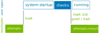

.. _sec_ref:

Reference
=========

.. contents::
   :local:
   :depth: 1

.. _sec_ref_slot_config:

System Configuration File
-------------------------

A configuration file named ``system.conf`` describes the number and type of
available slots.

This file is loaded from one of the listed directories in
order of priority, only the first file found is used:
``/etc/rauc/``, ``/run/rauc/``, ``/usr/lib/rauc/``.

It is used to validate storage locations for update images.
Each board type requires its special configuration.

This file is part of the root file system.

.. note:: When changing the configuration file on your running target you need
  to restart the RAUC service in order to let the changes take effect.

Example configuration:

.. code-block:: cfg

  [system]
  compatible=FooCorp Super BarBazzer
  bootloader=barebox
  data-directory=/srv/rauc
  bundle-formats=-plain

  [keyring]
  path=/etc/rauc/keyring.pem

  [handlers]
  system-info=/usr/lib/rauc/info-provider.sh
  post-install=/usr/lib/rauc/postinst.sh

  [slot.rootfs.0]
  device=/dev/sda0
  type=ext4
  bootname=system0

  [slot.rootfs.1]
  device=/dev/sda1
  type=ext4
  bootname=system1

  [artifacts.add-ons]
  path=/srv/add-ons
  type=trees

.. _system-section:

``[system]`` Section
~~~~~~~~~~~~~~~~~~~~

``compatible`` (required)
  A user-defined compatible string that describes the target hardware as
  specific enough as required to prevent faulty updating systems with the wrong
  firmware. It will be matched against the ``compatible`` string defined in the
  update manifest.

``min-bundle-version`` (optional)
  An optional user-defined version string that follows the
  `semantic versioning scheme <https://semver.org>`_.
  The 'version core' and '-pre_release' parts from the ``version`` string in the
  update manifest are compared against the configured ``min-bundle-version``.
  The update will be rejected if the bundle manifest version is smaller/older.

  This allows to roll out updates with some (breaking) changes by shipping them with
  a system.conf that sets the ``min-bundle-version`` accordingly.
  Once the updated system runs, it will prevent the installation of future updates
  with smaller/older bundle manifest versions.

  Note that equating the bundle-version with the system-version in this way has
  the caveat that cases where a rollback (due to a regression for example)
  would be required, could lead to scenarios where the bundle version would
  need to be incremented to pass the version-limit, but the rolled back system
  version would end up at a number below the limit. E.g. 1.2.9 = good; update
  to 1.3.0 with limit set to 1.3.0; problems!; update-bundle version:=1.3.1 but
  with content=1.2.9.

  Also note that the implementation in RAUC relaxes the strict Major.Minor.Path
  version-core format imposed by the semantic versioning scheme. To accommodate
  versioning schemes that use YEAR.MONTH or similar, version-cores with just
  Major or Major.Minor are also allowed.

``bootloader`` (required)
  The bootloader implementation RAUC should use for its slot switching
  mechanism. Currently supported values (and bootloaders) are ``barebox``,
  ``grub``, ``uboot``, ``efi``, ``custom``, ``noop``.

.. _bundle-formats:

``bundle-formats`` (optional, recommended)
  This option controls which :ref:`bundle formats<sec_ref_formats>` are allowed
  when verifying a bundle.
  You can either specify them explicitly by using a space-separated list for
  format names (such as ``plain verity``).
  In this case, any future changes of the built-in defaults will have no
  effect.

  Alternatively, you can use format names prefixed by ``-`` or ``+`` (such as
  ``-plain``) to enable or disable formats relative to the default
  configuration. This way, formats added in newer releases will be active
  automatically.

``mountprefix`` (optional)
  Prefix of the path where bundles and slots will be mounted. Can be overwritten
  by the command line option ``--mount``. Defaults to ``/mnt/rauc/``.

``grubenv`` (optional)
  Only valid when ``bootloader`` is set to ``grub``.
  Specifies the path under which the GRUB environment can be accessed.

``barebox-statename`` (optional)
  Only valid when ``bootloader`` is set to ``barebox``.
  Overwrites the default state ``state`` to a user-defined state name. If this
  key not exists, the bootchooser framework searches per default for ``/state``
  or ``/aliases/state``.

``barebox-dtbpath`` (optional)
  Only valid when ``bootloader`` is set to ``barebox``.
  Allows to set a path to a separate devicetree (dtb) file to be used for
  reading `barebox state <https://www.barebox.org/doc/latest/user/state.html>`_
  definition from.
  This is mainly useful for systems that do not use devicetrees by default,
  like x86 systems.

  .. note:: Requires to have at least `dt-utils
     <https://git.pengutronix.de/cgit/tools/dt-utils>`_ version 2021.03.0

``boot-attempts`` (optional)
  This configures the number of boot attempts to set when a slot is marked good
  through the D-Bus API or via the command line tool.
  The configured value should match the bootloader's reset value for attempts.
  This is currently only supported when ``bootloader`` is set to ``uboot`` or
  ``barebox`` and defaults to 3 if not set.

``boot-attempts-primary`` (optional)
  This configures the number of boot attempts to set when a slot is marked as
  primary (i.e., when an update was installed successfully).
  This is currently only supported when ``bootloader`` is set to ``uboot`` or
  ``barebox`` and defaults to 3 if not set.

``efi-use-bootnext`` (optional)
  Only valid when ``bootloader`` is set to ``efi``.
  If set to ``false``, this disables using efi variable ``BootNext`` for
  marking a slot primary.
  This is useful for setups where the BIOS already handles the slot switching
  on watchdog resets.
  Behavior defaults to ``true`` if the option is not set.

.. _activate-installed:

``activate-installed`` (optional)
  This boolean value controls if a freshly installed slot is automatically
  marked active with respect to the used bootloader. Its default value is
  ``true`` which means that this slot is going to be started the next time the
  system boots. If the value of this parameter is ``false`` the slot has to be
  activated manually in order to be booted, see section :ref:`mark-active`.

.. _statusfile:

``statusfile`` (deprecated, optional)
  .. note:: This option is deprecated. Consider using ``data-directory``
     instead.
     For more details about backwards compatibility, see :ref:`data-directory
     <data-directory>`.

  Can be set to point to a central file where slot status information should be
  stored (e.g. slot-specific metadata, see :ref:`slot-status`).

  .. important:: This file must be located on a non-redundant filesystem which
     is not overwritten during updates.

.. _data-directory:

``data-directory`` (optional, recommended)
  This path configures the directory where RAUC should store its slot status
  and any other internal information.
  In most cases, a shared RAUC data directory is preferable, as it allows
  storing data also for read-only or filesystem-less slots.

  We have multiple levels of backwards compatibility:

  * per-slot status and no shared data directory
    (by default or explicitly with ``statusfile=per-slot``)
  * central status file and no shared data directory
    (``statusfile=/data/central.raucs``)
  * central status file and shared data directory
    (``statusfile=/data/central.raucs`` and ``data-directory=/data/rauc``)
  * central status file in shared data directory
    (``data-directory=/data/rauc``, implies ``statusfile=/data/rauc/central.raucs``)

  .. important:: This directory must be located on a non-redundant filesystem
     which is not overwritten during updates.

``max-bundle-download-size`` (optional)
  Defines the maximum downloadable bundle size in bytes, and thus must be
  a simple integer value (without unit) greater than zero.
  It overwrites the compiled-in default value of 8388608 (8 MiB).
  If RAUC is configured with streaming support, this has no effect, as the
  bundle is not downloaded as a whole.

``max-bundle-signature-size`` (optional)
  Defines the maximum bundle signature size in bytes, and thus must be a simple
  integer value (without unit) greater than zero.
  It overwrites the compiled-in default value of 64 KiB.
  As this limit also applies to the encrypted signature when using ``crypt``
  bundles, you may need to increase it if you encrypt to a large number of
  recipients.

``variant-name`` (optional)
  String to be used as variant name for this board.
  If set, neither ``variant-file`` nor ``variant-dtb`` must be set.
  Refer chapter :ref:`sec-variants` for more information.

``variant-file`` (optional)
  File containing variant name for this board.
  If set, neither ``variant-name`` nor ``variant-dtb`` must be set.
  Refer chapter :ref:`sec-variants` for more information.

``variant-dtb`` (optional)
  If set to ``true``, use current device tree compatible as this boards variant
  name.
  If set, neither ``variant-name`` nor ``variant-file`` must be set.
  Refer chapter :ref:`sec-variants` for more information.

.. _perform-pre-check:

``perform-pre-check`` (optional)
  For ``verity`` and ``crypt`` bundles, this boolean value controls whether the complete
  bundle is checked for data corruption before it is mounted.
  Normally, this option is not needed as every access to the bundle payload during
  installation is already protected by ``dm-verity``.
  The default value is ``false`` which means that this pre-check is not performed.

  This option is useful when the installation should be aborted early even if the corrupt
  part of the bundle is not used during installation (perhaps due to adaptive updates or
  image variants).

  It has no effect for ``plain`` bundles, as the signature verification already checks the
  whole bundle.

``prevent-late-fallback=<true/false>`` (optional)
  In some use-cases, fallback to an older version must be prevented after the
  update is completed successfully (``rauc status mark-good`` executed from the
  new version).
  If this option is enabled, RAUC will execute the equivalent of ``rauc status
  mark-bad other`` after marking the currently booted slot as good.
  This means that the other slot(s) is/are no longer eligible for fallback.

.. _keyring-section:

``[keyring]`` Section
~~~~~~~~~~~~~~~~~~~~~

The ``keyring`` section refers to the trusted keyring used for signature
verification.
Both ``path`` and ``directory`` options can be used together if
desired, though only one or the other is necessary to verify the bundle
signature.

``path`` (optional)
  Path to the keyring file in PEM format. Either absolute or relative to the
  system.conf file.

``directory`` (optional)
  Path to the keyring directory containing one or more certificates.
  Each file in this directory must contain exactly one certificate in CRL or
  PEM format.
  The filename of each certificate must have the form hash.N for a certificate
  or hash.rN for CRLs;
  where hash is obtained by ``X509_NAME_hash(3)`` or the ``--hash`` option of
  ``openssl(1)`` ``x509`` or ``crl`` commands.
  See documentation in ``X509_LOOKUP_hash_dir(3)`` for details.

``use-bundle-signing-time=<true/false>`` (optional)
  If this boolean value is set to ``true`` then the bundle signing time
  is used instead of the current system time for certificate validation.

.. _allow-partial-chain:

``allow-partial-chain=<true/false>`` (optional)
  If this boolean value is set to ``true``, RAUC will also treat intermediate
  certificates in the keyring as trust-anchors, in addition to self-signed root
  CA certificates.
  This makes it possible to trust only one (or more) sub-tree(s) in a larger
  PKI.

  Note that without the root CA certificate in the keyring, CRLs signed by it
  can not be authenticated.
  If CRL checking is needed, the PKI needs to be structured with this in mind.

``allowed-signer-cns=Name 1;Other Name`` (optional)
  If this config parameter is set, RAUC will check the ``CommonName`` field
  of the bundle's signer certificates against this semicolon-separated list.
  If no signature from a certificate with a matching ``CommonName`` is found,
  the target device is not eligible for the update bundle and the update process
  is aborted.

  This parameter can be used instead of relying on the RAUC system compatible check
  if only specific certificates in a shared PKI are trusted
  for specific target devices.
  If the ``allowed-signer-cns`` check fails, no code from the bundle is executed,
  so unlike the system compatible check, it cannot be overridden by an
  ``install-check`` hook.

  This parameter can contain multiple values, separated by semicolons.
  Values can contain whitespace.

``check-crl=<true/false>`` (optional)
  If this boolean value is set to ``true``, RAUC will enable checking of CRLs
  (Certificate Revocation Lists) stored in the keyring together with the CA
  certificates.
  Note that CRLs have an expiration time in their signature, so you need to
  make sure you don't end up with an expired CRL on your device (which would
  block further updates).

.. _check-purpose:

``check-purpose`` (optional)
  This option can be used to set the OpenSSL certificate purpose used during
  chain verification.
  Certificates in the chain with incompatible purposes are rejected.
  Possible values are provided by OpenSSL (``any``, ``sslclient``,
  ``sslserver``, ``nssslserver``, ``smimesign``, ``smimeencrypt``) and RAUC
  (``codesign``).
  See ``-purpose`` and ``VERIFY OPERATION`` in the OpenSSL verify_ manual page
  and the :ref:`sec-key-usage` section for more information.

.. _verify: https://www.openssl.org/docs/man1.1.1/man1/verify.html

.. _streaming-config-section:

``[streaming]`` Section
~~~~~~~~~~~~~~~~~~~~~~~

The ``streaming`` section contains streaming-related settings.
For more information about using the streaming support of RAUC, refer to
:ref:`http-streaming`.

``sandbox-user`` (optional)
  This option can be used to set the user name which is used to run the
  streaming helper process.
  By default, the ``nobody`` user is used.
  At compile time, the default can be defined using the
  ``-Dstreaming_user=USERNAME`` meson setup option.

``tls-cert`` (optional)
  This option can be used to set the path or PKCS#11 URL for the TLS/HTTPS
  client certificate.

``tls-key`` (optional)
  This option can be used to set the path or PKCS#11 URL for the TLS/HTTPS
  client private key.

``tls-ca`` (optional)
  This option can be used to set the path of the CA certificate which should be
  used instead of the system wide store of trusted TLS/HTTPS certificates.

.. _send-headers:

``send-headers`` (optional)
  This option takes a ``;``-separated list of information to send as HTTP
  header fields to the server with the first request.

  Supported values are:

  * ``boot-id``: Enables sending the *boot_id* as ``RAUC-Boot-ID`` header field.
  * ``machine-id``: Enables sending the *machine-id* as ``RAUC-Machine-ID`` header field.

    .. note:: The machine ID should be considered "confidential" and thus not
       be used over unauthenticated connections or with untrusted servers!
  * ``system-version``: Enables sending the *system version* as ``RAUC-System-Version`` header field.
  * ``serial``: Enables sending the *system serial* as ``RAUC-Serial`` header field.
  * ``variant``: Enables sending the *variant* as ``RAUC-Variant`` header field.
  * ``transaction-id``: Enables sending the *transaction UUID* as ``RAUC-Transaction-ID`` header field.
  * ``uptime``: Enables sending the system's current uptime as ``RAUC-Uptime`` header field.

  These headers are sent on the initial HTTP request when streaming a bundle,
  e.g. when using ``rauc install`` or ``rauc info`` (or their corresponding D-Bus
  calls).
  They are *not* sent for the subsequent requests which fetch the actual bundle
  data.

  .. note::
    Currently, when using ``rauc info`` without the service or without an
    explicit config file, most headers are not sent, because the
    ``system-info`` handler is not used and the status information is not
    loaded.

``[encryption]`` Section
~~~~~~~~~~~~~~~~~~~~~~~~

The ``encryption`` section contains information required to decrypt a 'crypt'
bundle.
For more information about encrypted RAUC bundle bundles, refer to
:ref:`sec-encryption`.

``key`` (required to use encryption)
  Path or PKCS#11 URL for the private key used to decrypt bundles.

``cert`` (optional)
  Path or PKCS#11 URL for the certificate matching the encryption key.
  This is optional but allows to speed up key lookup and thus is especially
  useful for larger number of recipients.

``[casync]`` Section
~~~~~~~~~~~~~~~~~~~~

The ``casync`` section contains casync-related settings.
For more information about using the casync support of RAUC, refer to
:ref:`casync-support`.

``install-args`` (optional)
  Allows to specify additional arguments that will be passed to casync when
  installing an update. For example it can be used to include additional
  seeds or stores.

``storepath`` (optional)
  Allows to set the path to use as chunk store path for casync to a fixed one.
  This is useful if your chunk store is on a dedicated server and will be the
  same pool for each update you perform.
  By default, the chunk store path is derived from the location of the RAUC
  bundle you install.

``tmppath`` (optional)
  Allows to set the path to use as temporary directory for casync.
  The temporary directory used by casync can be specified using the TMPDIR
  environment variable. It falls back to /var/tmp if unset.
  If ``tmppath`` is set then RAUC runs casync with TMPDIR sets to that path.
  By default, the temporary directory is left unset by RAUC and casync uses its
  internal default value ``/var/tmp``.

``use-desync=<true/false>`` (optional)
  If this boolean value is set to ``true``, RAUC will use desync instead of
  casync. Desync support is still experimental, use with caution.

``[autoinstall]`` Section
~~~~~~~~~~~~~~~~~~~~~~~~~

The auto-install feature allows to configure a path that will be checked upon
RAUC service startup.
If there is a bundle placed under this specific path, this bundle will be
installed automatically without any further interaction.

This feature is useful for automatically updating the slot RAUC currently runs
from, like for asymmetric redundancy setups where the update is always
performed from a dedicated (recovery) slot.

``path`` (optional)
  The full path of the bundle file to check for.
  If file at ``path`` exists, auto-install will be triggered.

.. _sec_ref_handlers:

``[handlers]`` Section
~~~~~~~~~~~~~~~~~~~~~~

Handlers allow to customize RAUC by placing scripts in the system that RAUC can
call for different purposes. All parameters expect pathnames to the script to
be executed. Pathnames are either absolute or relative to the system.conf file
location.

RAUC passes a set of environment variables to handler scripts.
See details about using handlers in `Custom Handlers (Interface)`_.

``system-info`` (optional)
  This handler will be called when RAUC starts up, right after loading the
  system configuration file.
  It is used for obtaining further information about the individual system RAUC
  runs on.
  The handler script must print the information to standard output in form of
  key value pairs.
  A valid generic key must start with ``RAUC_`` as prefix to be added to the
  system information; e.g. ``RAUC_KEY=value``.

  Some additional special keys that are supported, are:

  :``RAUC_SYSTEM_SERIAL``:
    Serial number of the individual board
  :``RAUC_SYSTEM_VARIANT``:
    Sets the RAUC system variant
  :``RAUC_SYSTEM_VERSION``:
    Sets the system version (depending on your versioning strategy, this could
    match the version of a previously installed bundle or be completely
    independent)

  System information is made available to other handlers via environment
  variables that have the exact same name and value.

  The ``system-info`` handler also allows to define custom information that is
  forwarded to the server upon RAUC's first streaming request.
  In order to define forwarded info, this must be returned as a key prefixed.
  with ``RAUC_HTTP_``.
  The generated header field will be name of the key (with out the prefix)
  where an ``RAUC-`` is prepended and all underscores are converted to
  hyphens.
  E.g. ``RAUC_HTTP_MY_CUSTOM_INFO=dummyvalue`` will emit a header
  ``RAUC-MY-CUSTOM-INFO: dummyvalue``.

``pre-install`` (optional)
  This handler will be called right before RAUC starts with the installation.
  This is after RAUC has verified and mounted the bundle, thus you can access
  bundle content.

``post-install`` (optional)
  This handler will be called after a successful installation.
  The bundle is still mounted at this moment, thus you could access data in it
  if required.

``bootloader-custom-backend`` (required for ``bootloader=custom``)
  This handler will be called to trigger the following actions:

  * get the primary slot
  * set the primary slot
  * get the boot state
  * set the boot state

  if a custom bootloader backend is used.
  See :ref:`sec-custom-bootloader-backend` for more details.

.. _slot.slot-class.idx-section:

``[slot.<slot-class>.<idx>]`` Sections
~~~~~~~~~~~~~~~~~~~~~~~~~~~~~~~~~~~~~~

Each slot is identified by a section starting with ``slot.`` followed by
the slot class name, and a slot number.
The ``<slot-class>`` name is used in the *update manifest* to target the correct
set of slots. It must not contain any ``.`` (dots) as these are used as
hierarchical separator.

``device=</path/to/dev>`` (required)
  The slot's device path.

``type=<type>`` (optional, recommended)
  The type describing the slot. Currently supported ``<type>`` values are ``raw``,
  ``nand``, ``nor``, ``ubivol``, ``ubifs``, ``ext4``, ``vfat``, ``jffs2`` for normal slots
  and ``boot-emmc``, ``boot-mbr-switch``, ``boot-gpt-switch``, and ``boot-raw-fallback``
  for atomically updatable bootloader slots.
  See table :ref:`sec-slot-type` for a more detailed list of these different types.
  Defaults to ``raw`` if none given.

``extra-mkfs-opts=<options>`` (optional)
  Allows to specify custom filesystem creation options that will be passed to the slot's
  ``mkfs.<type>`` call (ext4, vfat, and ubifs only).

``bootname=<name>`` (optional)
  Registers the slot for being handled by the
  :ref:`bootselection interface <bootloader-interaction>` with the ``<name>``
  specified.
  The value must be unique across all slots.
  Only slots without a ``parent`` entry can have a ``bootname``.
  The actual meaning of the name provided depends on the bootloader
  implementation used.

``parent=<slot>`` (optional)
  The ``parent`` entry is used to bind additional slots to a bootable root
  file system ``<slot>``.
  Indirect parent references are discouraged, but supported for now.
  This is used together with the ``bootname`` to identify the set of currently
  active slots, so that the inactive one can be selected as the update target.
  The parent slot is referenced using the form ``<slot-class>.<idx>``.

``allow-mounted=<true/false>`` (optional)
  Setting this entry ``true`` tells RAUC that the slot may be updated even if
  it is already mounted.
  Such a slot can be updated only by a custom install hook.

``readonly=<true/false>`` (optional)
  Marks the slot as existing but not updatable. May be used for sanity checking
  or informative purpose. A ``readonly`` slot cannot be a target slot.

.. _install-same:

``install-same=<true/false>`` (optional)
  If set to ``false``, this will tell RAUC to skip writing slots that already
  have the same content as the one that should be installed.
  Having the 'same' content means that the hash value stored for the target
  slot and the hash value of the update image are equal.
  The default value is ``true`` here, meaning that no optimization will be done
  as this can be unexpected if RAUC is not the only one that potentially alters
  a slot's content.

  This replaces the deprecated entries ``ignore-checksum`` and
  ``force-install-same``.

``resize=<true/false>`` (optional)
  If set to ``true`` this will tell RAUC to resize the filesystem after having
  written the image to this slot. This only has an effect when writing an ext4
  file system to an ext4 slot, i.e. if the slot has``type=ext4`` set.

``extra-mount-opts=<options>`` (optional)
  Allows to specify custom mount options that will be passed to the slot's
  ``mount`` call as ``-o`` argument value.

``region-start=`` (mandatory for specific types, invalid for others)
  Defines the start of the disk region used for atomic bootloader updates.
  Valid for slot types ``boot-mbr-switch``, ``boot-gpt-switch``,
  ``boot-raw-fallback`` only!

  Accepts integer values in bytes.
  Supports optional size suffixes: ``K``, ``M``, ``G``, ``T`` (powers of 1024).

  See :ref:`sec-mbr-partition` and the following for more details.

``region-size`` (mandatory for specific types, invalid for others)
  Defines the size of the disk region used for atomic bootloader updates.
  Valid for slot types ``boot-mbr-switch``, ``boot-gpt-switch``,
  ``boot-raw-fallback`` only!

  Accepts integer values in bytes.
  Supports optional size suffixes: ``K``, ``M``, ``G``, ``T`` (powers of 1024).

  See :ref:`sec-mbr-partition` and the following for more details.

``size-limit=<value>`` (type-specific, optional)
  .. warning:: The ``size-limit`` option is intended only for backwards
     compatibility and should not be used in new designs!

  Valid for slot type ``boot-emmc`` only.
  Allows defining the maximum size of an eMMC boot partition to write.
  This is only useful if the eMMC boot partitions contain e.g. manufacturer
  at the end and, for certain reason, this cannot be migrated to a more
  appropriate location anymore.

  Accepts integer values in bytes.
  Supports optional size suffixes: ``K``, ``M``, ``G``, ``T`` (powers of 1024).

.. _sec_ref_artifacts:

``[artifacts.<repo-name>]`` Sections
~~~~~~~~~~~~~~~~~~~~~~~~~~~~~~~~~~~~

Each :ref:`artifact repository <sec-basic-artifact-repositories>` is identified
by a section starting with ``artifacts.`` followed by the repository name.
The ``<repo-name>`` name is used in the *update manifest* to target the correct
repository.
It must not contain any ``.`` (dots) as these are used as hierarchical
separator.
The name must be different from any slot class names.

``path=</repo/path>`` (required)
  Full path to a directory (on a shared partition) to be used to store the
  artifacts.
  The underlying shared partition must be mounted before starting RAUC.

``type=<type>`` (required)
  The type of this repository.
  Currently supported values are ``files`` and ``trees``.

  ``files``
    each artifact is a single file

  ``trees``
    each artifact is a directory tree containing files

  ``composefs``
    each artifact is a directory containing a composefs metadata image

  See :ref:`sec-repository-types` for more details.

``description=<string>`` (optional)
  A description of this repository.

``parent-class=<slot-class>`` (optional)
  Reference to a slot class, if the set of installed artifacts should be managed
  separately for each instance of that class, instead of globally.
  If so, it should refer to the class of the rootfs slots.

  .. warning:: Support for parent classes is not fully implemented yet. Do not use.

.. _ref-logger-sections:

``[log.<logger>]`` Sections
~~~~~~~~~~~~~~~~~~~~~~~~~~~

With a logger section, a *RAUC event logger* can be configured.
The ``<logger>`` suffix determines the internal name of the logger and must be
unique per ``system.conf``.

For an overview over the event logging framework in RAUC and its purpose, have
a look at :ref:`sec-advanced-event-log`.

``filename`` (required)
  The log file name used for logging.
  If no absolute path is given, the location is assumed to be relative to the
  ``data-directory``.
  Using a relative file name without ``data-directory`` set will cause a
  configuration error.

``events`` (optional)
  Semicolon-separated list of events to log. Currently supported event types are:

  * ``install`` - Logs start and end of installation
  * ``boot`` - Logs boot information
  * ``mark`` - Logs slot marking information
  * ``all`` - Log all events (default, cannot be combined with other events)

``format`` (optional)
  The output format used for the logger. Supported values are

  * ``readable``: readable multi-line output (default)
  * ``short``: Single-line readable output
  * ``json``: single-line JSON output
  * ``json-pretty``: formatted JSON output

``max-size=<value>`` (optional)
  Allows to configure a basic log rotation.
  When given, the logger's log file will be rotated before reaching
  the size configured with ``max-size`` and renamed to ``<filename>.1``.
  Existing rotation file names will be incremented by one.
  The oldest file is removed.
  To configure a maximum number of files to keep, see ``max-files``.

  Accepts integer values in bytes.
  Supports optional size suffixes: ``K``, ``M``, ``G``, ``T`` (powers of 1024).

``max-files`` (optional)
  Configures the maximum number of files to keep per logger.
  E.g. if set to ``3``, only ``<filename>``, ``<filename>.1`` and
  ``<filename>.2`` will be kept during rotation.
  Defaults to 10 if unset.

.. _sec_ref_manifest:

Manifest
--------

The manifest file located in a RAUC bundle describes the images packed in the
bundle and their corresponding target slot class.

A valid RAUC manifest file must be named ``manifest.raucm``.

.. code-block:: cfg

  [update]
  compatible=FooCorp Super BarBazzer
  version=2016.08-1

  [bundle]
  format=verity
  verity-hash=3fcb193cb4fd475aa174efa1f1e979b2d649bf7f8224cc97f4413b5ee141a4e9
  verity-salt=4b7b8657d03759d387f24fb7bb46891771e1b370fff38c70488e6381d6a10e49
  verity-size=24576

  [image.rootfs]
  filename=rootfs.ext4
  size=419430400
  sha256=b14c1457dc10469418b4154fef29a90e1ffb4dddd308bf0f2456d436963ef5b3

  [image.appfs]
  filename=appfs.ext4
  size=219430400
  sha256=ecf4c031d01cb9bfa9aa5ecfce93efcf9149544bdbf91178d2c2d9d1d24076ca

  [image.add-ons/webserver]
  filename=webserver.tar
  size=6573863
  sha256=f23204174c70ff03a9efcd6c2dfd6d2b8ebdd8bb66936043341e728438a1f0ea

.. _sec-manifest-update:

``[update]`` Section
~~~~~~~~~~~~~~~~~~~~

This section contains some high-level information about the bundle.

``compatible`` (required)
  A user-defined compatible string that must match the RAUC compatible string
  of the system the bundle should be installed on.

``version`` (optional)
  A free version field that can be used to provide and track version
  information. No checks will be performed on this version by RAUC itself,
  although a handler can use this information to reject updates.

``description`` (optional)
  A free-form description field that can be used to provide human-readable
  bundle information.

``build`` (optional)
  A build id that would typically hold the build date or some build
  information provided by the bundle creation environment. This can help to
  determine the date and origin of the built bundle.

``min-rauc-version`` (optional)
  An optional version limit which causes the manifest to be rejected if the
  running version is older/lower than the requested minimum.
  This was introduced with version 1.14 and will cause an error on older
  versions.

``[bundle]`` Section
~~~~~~~~~~~~~~~~~~~~

The bundle section contains information required to process the bundle.

``format`` (optional, recommended)
  Either ``plain`` (default), ``verity`` or ``crypt``.
  This selects the :ref:`format<sec_ref_formats>` used when wrapping the payload
  during bundle creation.

.. _verity-metadata:

``verity-hash`` (generated)
  The dm-verity root hash over the bundle payload in hexadecimal.
  RAUC determines this value automatically, so it should be left unspecified
  when preparing a manifest for bundle creation.

``verity-salt`` (generated)
  The dm-verity salt over the bundle payload in hexadecimal.
  RAUC determines this value automatically, so it should be left unspecified
  when preparing a manifest for bundle creation.

``verity-size`` (generated)
  The size of the dm-verity hash tree.
  RAUC determines this value automatically, so it should be left unspecified
  when preparing a manifest for bundle creation.

``crypt-key`` (generated)
  The encryption key of the dm-crypt.
  RAUC generates the key automatically when creating a ``crypt`` bundle.

``[hooks]`` Section
~~~~~~~~~~~~~~~~~~~

The hooks section allows to provide a user-defined executable for
:ref:`executing hooks <sec-hooks>` during the installation.

``filename`` (optional)
  Hook script path name, relative to the bundle content.

``hooks`` (optional)
  List of hooks enabled for this bundle.
  See :ref:`sec-install-hooks` for more details.

  Valid items are: ``install-check``

.. _sec-manifest-handler:

``[handler]`` Section
~~~~~~~~~~~~~~~~~~~~~

The ``handler`` section refers to the
`full custom handler <https://rauc.readthedocs.io/en/latest/using.html#full-custom-update>`_
that allows to fully replace the default RAUC update process.

.. note:: This is not to be confused with the ``[handlers]`` section from the
   system.conf which defines e.g. pre- and post-install handlers!

When the full custom handler is enabled in a bundle, it will be invoked during
the bundle installation

* **after** bundle signature verification
* **after** slot state and target slots determination logic
* **after** the ``pre-install`` system handler
* **before** the ``post-install`` system handler

Also, the bundle will be mounted at this point and thus all its content is
available to the full custom handler.
Further system information is passed by RAUC via environment variables.
No built-in slot update will run and no hook will be executed.

``filename`` (optional)
  Full custom handler path, relative to the bundle content.
  Having this set will activate the full custom handler and use the given
  script/binary instead of the default handling.

``args`` (optional)
  Arguments to pass to the full custom handler, such as
  ``args=--setup --verbose``

  .. note:: Until RAUC v1.9, these arguments were also implicitly passed
     to handlers defined in the system.conf.
     This behavior was fixed/removed in v1.10.
     If someone uses this undocumented behavior and still requires this,
     please file an `issue <https://github.com/rauc/rauc/issues/new/choose>`_.

  If additional arguments are provided via ``--handler-args`` command line
  argument, these will be appended to the ones defined in the manifest.

.. _image-section:

``[image.*]`` Sections
~~~~~~~~~~~~~~~~~~~~~~

The image section names can take different forms to support slots, artifacts and
variants.

``[image.<slot-class>]``
  This form is used to specify images that should be installed to (inactive)
  slots of the given class.

``[image.<slot-class>.<variant>]``
  This form is used to specify an image that will be used instead of the default
  one above if the target system's variant matches ``<variant>``.
  Refer to chapter :ref:`sec-variants` for more information.

``[image.<artifact-repo-name>/<artifact-name>]``
  This form is used to specify an image that should be installed into an artifact
  repository.

``[image.<artifact-repo-name>/<artifact-name>.<variant>]``
  This form is not yet supported, but will be used to handle artifacts with
  variants.

The following fields are supported for image sections:

.. _image-filename:

``filename`` (required)
  Name of the image file (relative to bundle content).

  .. note::
    While RAUC can automatically detect the image type from filename extensions
    for backward compatibility, it is recommended to explicitly specify the
    ``type`` field for new projects or in cases where all target systems
    are running a new enough version.

  .. note::
    This field is not required and not supported for images with ``type=emptyfs``,
    which creates an empty filesystems without source data.

  .. important::
    RAUC uses the file name extension and the slot type to decide how to
    install the image file content to the slot.
    Make sure to only use :ref:`supported file name extensions
    <sec-ref-image-types-to-fileext-map>`!

.. _image-type:

``type`` (optional, recommended)
  Specifies the type of the image content.
  This determines how RAUC will process the image during installation.
  If not specified, the image type is automatically detected
  based on the filename extension.

  This was added in RAUC v1.15.

  Detailed information about the supported types is described in the
  :ref:`Supported Image Types <sec-ref-supported-image-types>` section.

``sha256`` (generated)
  sha256 of image file. RAUC determines this value automatically when creating
  a bundle, thus it is not required to set this by hand.

``size`` (generated)
  size of image file. RAUC determines this value automatically when creating a
  bundle, thus it is not required to set this by hand.

``hooks`` (optional)
  List of per-slot hooks enabled for this image.
  See :ref:`sec-slot-hooks` for more details.

  Valid items are: ``pre-install``, ``install``, ``post-install``

  Hooks are not yet supported for artifacts.

``adaptive`` (optional)
  List of ``;``-separated per-slot adaptive update method names.
  These methods will add extra information to the bundle, allowing RAUC to
  access only the parts of an image which are not yet available locally.
  Together with streaming, this reduces the amount of downloaded data.

  As the full image is still available in the bundle, older RAUC versions can
  ignore unsupported adaptive methods.

  Currently implemented adaptive methods:

  ``block-hash-index``
    Build an index which stores the SHA256 hash for each 4kiB block of the input
    image, allowing reuse of unchanged blocks.

    For information on this method, see :ref:`sec-adaptive-block-hash-index`.

  Adaptive update methods are currently not supported for artifacts.

``convert`` (optional)
  List of ``;``-separated conversion methods to use during bundle creation.
  The original image is not included in the bundle, except when ``keep`` is
  specified.

  Currently implemented conversion methods:

  ``tar-extract``
    Extract a tar into a directory tree.
    This method is not very useful on its own, but can be used to test creation
    and installation of bundles containing many files.
    The underlying implementation will also be used for future methods.

  ``composefs``
    Create a composefs metadata image and object store from a tar archive.
    File contents from all composefs artifacts are placed in a shared object
    store in the bundle (`<bundle>/.rauc-cfs-store`).
    This way, duplicated files are stored in the bundle only once.
    During bundle creation, ``fakeroot`` needs to be available when not running
    under ``pseudo``.

  ``keep``
    Keep the original image after running the conversion methods.

  Conversion methods are currently not supported for slot images.

``converted`` (generated)
  List of ``;``-separated output file/directory names from conversion methods,
  as generated by RAUC during bundle creation.
  Each element in the ``convert`` list has a corresponding entry in this list.

.. _rollout-section:

``[rollout]`` Section
~~~~~~~~~~~~~~~~~~~~~

The ``rollout`` section is intended to provide a forwards-compatible way to add
rollout scheduling configuration (e.g. phases or time windows) to the manifest.
Currently, the contents are not interpreted by RAUC in any way.

.. _meta.label-section:

``[meta.<label>]`` Sections
~~~~~~~~~~~~~~~~~~~~~~~~~~~

The ``meta.<label>`` sections are intended to provide a forwards-compatible
way to add metadata to the manifest which is not interpreted by RAUC in any
way.
They are accessible via ``rauc info``, the :ref:`"InspectBundle" D-Bus API
<gdbus-method-de-pengutronix-rauc-Installer.InspectBundle>`, pre-/post-install
:ref:`handlers <sec-handler-interface>` and the ``install-check`` hook.
In future releases, they will be accessible in other hooks, as well.

``<key>`` (optional)
  Keys (and values) can be defined freely in this section.

  As they may need to be converted to environment variable names, only
  alphanumeric characters, ``-`` and ``_`` are allowed in ``<label>`` and
  ``<key>``.
  ``-`` is converted to ``_`` for use as an environment variable name.

.. _sec-ref-supported-image-types:

Supported Image Types
~~~~~~~~~~~~~~~~~~~~~
.. note::
  RAUC v1.15 or newer support setting an explicit ``type`` field
  instead of using the filename extensions to determine the image type.
  For backward compatibility, RAUC can still derive the image type
  from file name extensions.

RAUC uses the image ``type`` in combination with the slot ``type``
to determine how to process images during installation.
When the ``type`` parameter is set, the filename extension is not taken into
account and can be chosen freely.

Supported file system image types are:

  * ``ext4``: ext[234] file system image
  * ``vfat``: vfat file system image (sometimes used for the EFI System Partition)
  * ``ubifs``: UBIFS file system image
  * ``squashfs``: SquashFS image (uncompressed, or compressed with one of ``lz4``, ``lzo``, ``xz``, ``xst``)
  * ``emptyfs``: Creates an empty filesystem.
    This type does not support setting a ``filename`` as no source data is needed.
    Currently only supports slots with `type=ext4`, see :ref:`slot.slot-class.idx-section`

Supported binary image types are:

  * ``raw``: Generic image format (raw binary data)

    .. note::
      The ``raw`` type is valid for all slot types and should be used for raw
      binary data like bootloader images, firmware binaries, etc.

Supported archive types are:

  * ``tar``: TAR archive (compressed or uncompressed)

For casync support, specific image types are available:

  * ``caidx``: casync directory tree index
  * ``ext4-caibx``: ext4 file system image in casync blob index format
  * ``vfat-caibx``: vfat file system image in casync blob index format
  * ``ubifs-caibx``: UBIFS file system image in casync blob index format
  * ``squashfs-caibx``: SquashFS image in casync blob index format
  * ``raw-caibx``: Generic image in casync blob index format
  * ``catar``: casync directory tree archive

.. _sec-ref-image-types-to-fileext-map:

If no ``type`` is given for the image, the following file name extensions are
mapped automatically by RAUC:

  * ``*.ext4.caibx`` -> ``ext4-caibx``
  * ``*.vfat.caibx`` -> ``vfat-caibx``
  * ``*.ubifs.caibx`` -> ``ubifs-caibx``
  * ``*.img.caibx`` -> ``raw-caibx``
  * ``*.squashfs.caibx`` -> ``squashfs-caibx``
  * ``*.squashfs-*.caibx`` -> ``squashfs-caibx``
  * ``*.catar`` -> ``catar``
  * ``*.caidx`` -> ``caidx``
  * ``*.tar*`` -> ``tar``
  * ``*.tgz`` -> ``tar``
  * ``*.ext4`` -> ``ext4``
  * ``*.vfat`` -> ``vfat``
  * ``*.img`` -> ``raw``
  * ``*.squashfs-*`` -> ``squashfs``
  * ``*.squashfs`` -> ``squashfs``
  * ``*.ubifs`` -> ``ubifs``

.. _sec_ref_formats:

Bundle Formats
--------------

RAUC currently supports three bundle formats (``plain``,  ``verity`` and
``crypt``) and additional formats could be added if required.
When starting a new project, the ``verity`` or ``crypt`` formats should be used.

Version 1.4 (released on 2020-06-20) and earlier only supported a single format
now named ``plain``, which should only be used as long as compatibility with
older versions is required.
For information on how to migrate to the recommended ``verity`` format, see
:ref:`sec_int_migration`).

The ``verity`` format was added to support new use cases like network
streaming, for better parallelization of installation with hash verification
and to detect modification of the bundle during installation.

The ``crypt`` format is an extension to the ``verity`` format that allows full
encryption of the bundle.

The bundle format is detected when reading a bundle and checked against the set
of allowed formats configured in the ``system.conf`` (using the :ref:`bundle-formats
<bundle-formats>` option).

.. note::
  When creating a bundle without an explicitly configured format, RAUC will warn
  about defaulting to ``plain`` and recommend to use ``verity`` instead.
  The warning can be silenced by explicitly configuring ``plain``, but note that
  this will produce bundles incompatible to 1.4 and earlier due to the added
  ``[bundle]`` section.
  In that case, we **strongly recommend** updating these systems.

.. _sec_ref_format_plain:

plain Format
~~~~~~~~~~~~

In this case, a bundle consists of:

- squashfs filesystem containing manifest and images
- detached CMS signature over the squashfs filesystem
- size of the CMS signature

With this format, the signature is checked in a full pass over the squashfs
before mounting or accessing it.
This makes it necessary to protect the bundle against modification by untrusted
processes.
To ensure exclusive access, RAUC takes ownership of the file (using chown) and
uses file leases to detect other open file descriptors.

.. _sec_ref_format_verity:

verity Format
~~~~~~~~~~~~~

In this case, a bundle consists of:

- squashfs filesystem containing manifest (without verity metadata) and images
- `dm-verity <https://www.kernel.org/doc/html/latest/admin-guide/device-mapper/verity.html>`_
  hash tree over the squashfs filesystem
- CMS signature over an inline manifest (with verity metadata)
- size of the CMS signature

With this format, the manifest is contained in the CMS signature itself, making
it accessible without first hashing the full squashfs.
The manifest contains the additional metadata (:ref:`root hash, salt and size
<verity-metadata>`) necessary to authenticate the hash tree and in turn each
block of the squashfs filesystem.

During installation, the kernel's verity device mapper target is used on top of
the loopback block device to authenticate each filesystem block as needed.

When using ``rauc extract`` (or other commands which need access to the squashfs
except `install`), the squashfs is checked before accessing it by RAUC itself
without using the kernel's device mapper target, as they are often used by
normal users on their development hosts.
It this case, the same mechanism for ensuring exclusive access as with plain
bundles is used.

.. _sec_ref_format_crypt:

crypt Format
~~~~~~~~~~~~

In this case, a bundle consists of:

* SquashFS filesystem containing manifest (without verity metadata or crypt key) and images,
  encrypted using dm-crypt mode aes-cbc-plain64
* dm-verity hash tree over the encrypted SquashFS filesystem
* CMS signature over an inline manifest (with verity metadata and crypt key),
  encrypted to a set of recipients
* size of the encrypted CMS structure

In addition to the metadata used by the verity format,
the manifest for this format contains the AES-256 key required for decryption of the SquashFS payload.
To protect the payload key, the signed manifest is then encrypted.

During installation, the kernel's crypt and verity device mapper targets are used on top of the
loopback or network block device to authenticate and then decrypt each payload block as needed.

.. _sec_ref_external_signing:

External Signing and PKI
~~~~~~~~~~~~~~~~~~~~~~~~

Some industrialization procedures require signing updates in a dedicated
secure room with restricted access.
Only there, access to the Public Key Infrastructure (aka PKI), is allowed.

For this case ``rauc extract-signature`` can extract the bundle signature and
``rauc replace-signature`` can replace the bundle signature with a new one.

As a ``verity`` format bundle signature is not a detached CMS, you can easily
resign it externally.

.. code-block:: console

  # Extract the bundle signature
  $ rauc extract-signature --keyring ca.cert.pem bundle.raucb extracted-signature.cms
  # Extract embedded manifest from the verity bundle CMS
  $ openssl cms -verify -CAfile ca.cert.pem -out manifest.raucm -inform DER -in extracted-signature.cms
  # Or without trust chain verification
  $ openssl cms -verify -noverify -out manifest.raucm -inform DER -in extracted-signature.cms
  # Sign the manifest with your external PKI (for this example, it was made by an ``openssl`` command)
  $ openssl cms -sign -signer new-signer.cert.pem -CAfile new-ca-cert.pem -inkey new-signer.key.pem -nodetach -in manifest.raucm -outform der -out new-signature.cms
  # Finally replace the bundle signature
  $ rauc replace-signature --keyring ca-cert.pem --signing-keyring new-ca-cert.pem bundle.raucb new-signature.cms new-bundle.raucb

For the ``plain`` format bundle signature it's slightly different, as the
signature is detached, it contains just the message digest.
You can use ``openssl asn1parse`` for retrieving the message digest in the CMS.

.. code-block:: console
  :emphasize-lines: 9,11

  # Find the line which contains ``:messageDigest`` in ``OBJECT`` section
  # and get offset of the next line which contains ``OCTET STRING`` (1125 in this case)
  $ openssl asn1parse -inform der -in extracted-signature.cms | grep -C 3 messageDigest
  1093:d=7  hl=2 l=  15 cons: SET
  1095:d=8  hl=2 l=  13 prim: UTCTIME           :170926142121Z
  1110:d=6  hl=2 l=  47 cons: SEQUENCE
  1112:d=7  hl=2 l=   9 prim: OBJECT            :messageDigest
  1123:d=7  hl=2 l=  34 cons: SET
  1125:d=8  hl=2 l=  32 prim: OCTET STRING      [HEX DUMP]:F3C783DF3F76D658798A7232255A155BB4E5DD90B0DDFFA57EE01968055161C5
  1159:d=6  hl=2 l= 121 cons: SEQUENCE
  # And extract the digest
  $ openssl asn1parse -strparse 1125 -inform DER -in extracted-signature.cms -noout -out - | xxd -ps -c 32
  f3c783df3f76d658798a7232255a155bb4e5dd90b0ddffa57ee01968055161c5

Unfortunately the OpenSSL command line tool does not support signing a
pre-existing digest, so you may need to use the PR `openssl/openssl#15348
<https://github.com/openssl/openssl/pull/15348>`_.
This is not necessary for a verity bundle format, as its CMS signature directly
contains the manifest.

Another method could be to extract the original binary from the RAUC bundle.

.. code-block:: console

  $ BUNDLE_SIZE="$(stat -L -c%s bundle.raucb)"
  $ CMS_SIZE="$(printf "%u" "0x$(tail -c "+$((( ${BUNDLE_SIZE} - 7 )))" bundle.raucb | xxd -ps)")"
  $ CMS_OFFSET=$((( ${BUNDLE_SIZE} - ${CMS_SIZE} - 7 )))
  # Extract binary to sign from the bundle
  $ dd if=bundle.raucb of=bundle.rauci bs=1 count=$((( ${CMS_OFFSET} - 1 )))
  $ sha256sum bundle.rauci
  f3c783df3f76d658798a7232255a155bb4e5dd90b0ddffa57ee01968055161c5  bundle.rauci
  # Sign the binary with your PKI (for this example, it was made by an ``openssl`` command)
  $ openssl cms -sign -signer new-signer.cert.pem -CAfile new-ca-cert.pem -inkey new-signer.key.pem -binary -in bundle.rauci -outform der -out new-signature.cms
  # Finally replace the bundle signature
  $ rauc replace-signature --keyring ca-cert.pem --signing-keyring new-ca-cert.pem bundle.raucb new-signature.cms new-bundle.raucb

.. note::
  The ``asn1parse`` method can also be used for the ``verity`` bundle but replacing
  ``:messageDigest`` by ``:pkcs7-data`` as follows

  .. code-block:: console
    :emphasize-lines: 13,15

    # Find the line which contains ``:pkcs7-data`` in ``OBJECT`` section
    # and get offset of the next line which contains ``OCTET STRING`` (60 in this case)
    $ openssl asn1parse -inform der -in extracted-signature.cms
    0:d=0  hl=4 l=1918 cons: SEQUENCE
    4:d=1  hl=2 l=   9 prim: OBJECT            :pkcs7-signedData
    15:d=1  hl=4 l=1903 cons: cont [ 0 ]
    19:d=2  hl=4 l=1899 cons: SEQUENCE
    23:d=3  hl=2 l=   1 prim: INTEGER           :01
    26:d=3  hl=2 l=  13 cons: SET
    28:d=4  hl=2 l=  11 cons: SEQUENCE
    30:d=5  hl=2 l=   9 prim: OBJECT            :sha256
    41:d=3  hl=4 l= 498 cons: SEQUENCE
    45:d=4  hl=2 l=   9 prim: OBJECT            :pkcs7-data
    56:d=4  hl=4 l= 483 cons: cont [ 0 ]
    60:d=5  hl=4 l= 479 prim: OCTET STRING      :[update]
    compatible=Test Config
    version=2011.03-2

    [bundle]
    format=verity
    verity-hash=931b44c2989432c0fcfcd215ec94384576b973d70530fdc75b6c4c67b0a60297
    verity-salt=ea12cb34c699ebbad0ebee8f6aca0049ee991f289011345d9cdb473ba4fdd285
    verity-size=4096

    [image.rootfs]
    sha256=101a4fc5c369a5c89a51a61bcbacedc9016e9510e59a4383f739ef55521f678d
    size=8192
    filename=rootfs.img

    [image.appfs]
    sha256=f95c0891937265df18ff962869b78e32148e7e97eab53fad7341536a24242450
    size=8192
    filename=appfs.img

    543:d=3  hl=4 l= 900 cons: cont [ 0 ]
    547:d=4  hl=4 l= 896 cons: SEQUENCE
    551:d=5  hl=4 l= 616 cons: SEQUENCE
    555:d=6  hl=2 l=   3 cons: cont [ 0 ]
    557:d=7  hl=2 l=   1 prim: INTEGER           :02
    560:d=6  hl=2 l=   1 prim: INTEGER           :01
    563:d=6  hl=2 l=  13 cons: SEQUENCE
    565:d=7  hl=2 l=   9 prim: OBJECT            :sha256WithRSAEncryption
    [...]
    # And extract the manifest
    $ openssl asn1parse -strparse 60 -inform DER -in extracted-signature.cms -noout -out -
    [update]
    compatible=Test Config
    version=2011.03-2

    [bundle]
    format=verity
    verity-hash=931b44c2989432c0fcfcd215ec94384576b973d70530fdc75b6c4c67b0a60297
    verity-salt=ea12cb34c699ebbad0ebee8f6aca0049ee991f289011345d9cdb473ba4fdd285
    verity-size=4096

    [image.rootfs]
    sha256=101a4fc5c369a5c89a51a61bcbacedc9016e9510e59a4383f739ef55521f678d
    size=8192
    filename=rootfs.img

    [image.appfs]
    sha256=f95c0891937265df18ff962869b78e32148e7e97eab53fad7341536a24242450
    size=8192
    filename=appfs.img

.. _slot-status:

Slot Status File
----------------

For each slot, RAUC tracks some status data like the state of the slot, the
origin of its content and a minimal installation history.
RAUC provides this information via the :ref:`GetSlotStatus
<gdbus-method-de-pengutronix-rauc-Installer.GetSlotStatus>` D-Bus method or
prints it when ``rauc status`` is called with the ``--detailed`` options.

The recommended way to store slot data is on a shared partition within
RAUC's :ref:`data-directory <data-directory>`.
When the data directory is enabled, the file ``<data-directory>/central.raucs``
is used to store information for all slots.
The same file is also used for storing :ref:`system status <system-status>`
information.
If no shared partition is available, RAUC can store the status file as
``/slot.raucs`` on each slot that contains a writable filesystem.
Slots without a writable filesystem will not have any status data stored in this case.

Like the configuration files used by RAUC, the slot status files use a
key-value syntax, similar to that found in .ini files.

The information for each slot is grouped in a section like ``[slot.rootfs.1]``
for the central status file, or ``[slot]`` in case of a per-slot file.

.. code-block:: cfg

  [slot.rootfs.0]
  bundle.compatible=FooCorp Super BarBazzer
  bundle.version=2024.08-1
  bundle.description=Introduction of Galactic Feature XYZ
  bundle.build=2024.08.1/imx8mp/20240824-7
  status=ok
  sha256=b14c1457dc10469418b4154fef29a90e1ffb4dddd308bf0f2456d436963ef5b3
  size=419430400
  installed.transaction=dad3289a-7de1-4ad2-931e-fb827edc6496
  installed.timestamp=2024-09-06T09:51:13Z
  installed.count=3

The properties ``bundle.compatible``, ``bundle.version``, ``bundle.description``
and ``bundle.build`` are copies of the respective manifest properties.
More information can be found in this :ref:`subsection <sec-manifest-update>` of
section :ref:`Manifest <sec_ref_manifest>`.

The ``status`` field records the status of each slot.
It can have the following values:

:ok: The latest update for this slot succeeded. Its content should be valid.
:failed: The latest update for this slot failed. There is no valid content on it.
:pending: The slot is currently being updated. There is no valid content on it, yet.

For a description of ``sha256`` and ``size`` keys see :ref:`this
<image-section>` part of the section :ref:`Manifest
<sec_ref_manifest>`.
Having the slot's content's size allows to re-calculate the hash via ``head -c
<size> <slot-device> | sha256sum`` or ``dd bs=<size> count=1 if=<slot-device> |
sha256sum``.

RAUC also stores information about the installation run during which the slot
was updated:
In ``installed.transaction`` the installation transaction ID is noted,
while ``installed.timestamp`` notes the time when the slot's installation was
finished and ``installed.count`` reflects the number of updates the slot
received so far.
Additionally RAUC tracks the point in time when a bootable slot is activated in
``activated.timestamp`` and the number of activations in ``activated.count``,
see section :ref:`mark-active`.
Comparing both timestamps is useful to decide if an installed slot has ever been
activated or if its activation is still pending.

.. _system-status:

System Status File
------------------

The system status is only available if a central status file is configured for
RAUC (by setting :ref:`data-directory <data-directory>`).
The system status is stored in the same file as the :ref:`slot status
<slot-status>`. It uses a distinct ``[system]`` section.

.. code-block:: cfg

  [system]
  boot-id=d359b438-b28b-416b-9270-257484a8a58e

The field ``boot-id`` contains the system's boot ID
(``proc/sys/kernel/random/boot_id``) recorded on service startup.
RAUC uses this ID to differentiate between reboots and service restarts by
comparing it with the current boot ID.

Command Line Tool
-----------------

.. code-block:: man

  Usage:
    rauc [OPTION?] <COMMAND>

  Options:
    -c, --conf=FILENAME                 config file
    -C, --confopt=SECTION:KEY=VALUE     config settings that override parameters from the config file
    --keyring=PEMFILE                   keyring file
    --mount=PATH                        mount prefix
    -d, --debug                         enable debug output
    --version                           display version
    -h, --help                          display help and exit

  Command-specific help:
    rauc <COMMAND> --help

  List of rauc commands:
    bundle                Create a bundle
    resign                Resign an already signed bundle
    convert               Convert classic to casync bundle
    encrypt               Encrypt a crypt bundle
    replace-signature     Replaces the signature of an already signed bundle
    extract-signature     Extract the bundle signature
    extract               Extract the bundle content
    install               Install a bundle
    info                  Show bundle information
    mount                 Mount a bundle
    service               Start RAUC service
    status                Show status
    write-slot            Write image to slot and bypass all update logic

  Environment variables:
    RAUC_KEY_PASSPHRASE Passphrase to use for accessing key files (signing only)
    RAUC_PKCS11_MODULE  Library filename for PKCS#11 module (signing only)
    RAUC_PKCS11_PIN     PIN to use for accessing PKCS#11 keys (signing only)

.. note::
  Using -C / --confopt can not only override settings of the config file but also
  set new values that haven't been present before.

.. _sec-handler-interface:

Custom Handlers (Interface)
---------------------------

Interaction between RAUC and custom handler shell scripts is done using shell
variables.

``RAUC_SYSTEM_CONFIG``
  Path to the chosen system configuration file (e.g. ``/usr/lib/rauc/system.conf``
  if not overridden by a file in ``/etc`` or ``/run``)

``RAUC_SYSTEM_VARIANT``
  The system's variant as obtained by the variant source
  (refer :ref:`sec-variants`)

``RAUC_CURRENT_BOOTNAME``
  Bootname of the slot the system is currently booted from

``RAUC_BUNDLE_MOUNT_POINT``
  Path to mounted update bundle, e.g. ``/mnt/rauc/bundle``

``RAUC_UPDATE_SOURCE``
  A deprecated alias for ``RAUC_BUNDLE_MOUNT_POINT``

``RAUC_TRANSACTION_ID``
  A UUID of a particular installation. This is either generated by RAUC or
  provided explicitly on command line or over the D-Bus :ref:`InstallBundle
  <gdbus-method-de-pengutronix-rauc-Installer.InstallBundle>` method.

``RAUC_MOUNT_PREFIX``
  Provides the path prefix that may be used for RAUC mount points

``RAUC_META_*``
  Exposes the :ref:`meta-data sections <meta.label-section>` from the bundle's manifest.
  This uses the same format as ``rauc info --output-format=shell …``.

``RAUC_SLOTS``
  An iterator list to loop over all existing slots. Each item in the list is
  an integer referencing one of the slots. To get the slot parameters, you have to
  resolve the per-slot variables (suffixed with <N> placeholder for the
  respective slot number).

``RAUC_TARGET_SLOTS``
  An iterator list similar to ``RAUC_SLOTS`` but only containing slots that
  were selected as target slots by the RAUC target slot selection algorithm.
  You may use this list for safely installing images into these slots.

``RAUC_SLOT_NAME_<N>``
  The name of slot number <N>, e.g. ``rootfs.0``

``RAUC_SLOT_CLASS_<N>``
  The class of slot number <N>, e.g. ``rootfs``

``RAUC_SLOT_TYPE_<N>``
  The type of slot number <N>, e.g. ``raw``

``RAUC_SLOT_DEVICE_<N>``
  The device path of slot number <N>, e.g. ``/dev/sda1``

``RAUC_SLOT_BOOTNAME_<N>``
  The bootloader name of slot number <N>, e.g. ``system0``

``RAUC_SLOT_PARENT_<N>``
  The name of slot number <N>, empty if none, otherwise name of parent slot

.. code::

  for i in $RAUC_TARGET_SLOTS; do
          eval RAUC_SLOT_DEVICE=\$RAUC_SLOT_DEVICE_${i}
          eval RAUC_IMAGE_NAME=\$RAUC_IMAGE_NAME_${i}
          eval RAUC_IMAGE_DIGEST=\$RAUC_IMAGE_DIGEST_${i}
  done

Hooks (Interface)
-----------------

.. _sec-install-hook-interface:

Install Hooks Interface
~~~~~~~~~~~~~~~~~~~~~~~

The following environment variables will be passed to the hook executable:

``RAUC_SYSTEM_COMPATIBLE``
  The compatible value set in the system configuration file,
  e.g. ``"My First Product"``

``RAUC_SYSTEM_VARIANT``
  The system's variant as obtained by the variant source
  (refer :ref:`sec-variants`)

``RAUC_MF_COMPATIBLE``
  The compatible value provided by the current bundle,
  e.g. ``"My Other Product"``

``RAUC_MF_VERSION``
  The value of the version field as provided by the current bundle,
  e.g. ``"V1.2.1-2020-02-28"``

``RAUC_MF_BUILD``
  The value of the build field as provided by the current bundle,
  e.g. ``"20240205092747"``

``RAUC_MOUNT_PREFIX``
  The global RAUC mount prefix path, e.g. ``"/run/mount/rauc"``

.. _sec-slot-hook-interface:

Slot Hooks Interface
~~~~~~~~~~~~~~~~~~~~

The following environment variables will be passed to the hook executable:

``RAUC_SYSTEM_COMPATIBLE``
  The compatible value set in the system configuration file,
  e.g. ``"My Special Product"``

``RAUC_SYSTEM_VARIANT``
  The system's variant as obtained by the variant source
  (refer :ref:`sec-variants`)

``RAUC_SLOT_NAME``
  The name of the currently installed slot, e.g ``"rootfs.1"``.

``RAUC_SLOT_STATE``
  The state of the currently installed slot
  (will always be ``inactive`` for slots we install to)

``RAUC_SLOT_CLASS``
  The class of the currently installed slot, e.g. ``"rootfs"``

``RAUC_SLOT_TYPE``
  The type of the currently installed slot, e.g. ``"ext4"``

``RAUC_SLOT_DEVICE``
  The device path of the currently installed slot, e.g. ``"/dev/mmcblk0p2"``

  This equals the ``device=`` parameter set in the current slot's system.conf
  entry and represents the target device RAUC installs the update to.
  For an ``install`` hook, this is the device the hook executable should write
  to.

``RAUC_SLOT_BOOTNAME``
  For slots with a bootname (those that can be selected by the bootloader),
  the bootname of the currently installed slot, e.g. ``"system1"``
  For slots with a parent, the parent's bootname is used.
  Note that in many cases, it's better to use the explicit ``RAUC_SLOT_NAME``
  to select different behaviour in the hook, than to rely indirectly on the
  bootname.

``RAUC_SLOT_PARENT``
  If set, the parent of the currently installed slot, e.g. ``"rootfs.1"``

``RAUC_SLOT_MOUNT_POINT``
  If available, the mount point of the currently installed slot,
  e.g. ``"/run/mount/rauc/rootfs.1"``

  For mountable slots, i.e. those with a file system type, RAUC will attempt
  to automatically mount the slot if a pre-install or post-install hook is
  given and provide the slot's current mount point under this env variable.

``RAUC_IMAGE_NAME``
  If set, the file name of the image currently to be installed,
  e.g. ``"product-rootfs.img"``

``RAUC_IMAGE_SIZE``
  If set, the size of the image currently to be installed,
  e.g. ``"82628"``

``RAUC_IMAGE_DIGEST``
  If set, the digest of the image currently to be installed,
  e.g. ``"e29364a81c542755fd5b2c2461cd12b0610b67ceacabce41c102bba4202f2b43"``

``RAUC_IMAGE_CLASS``
  If set, the target class of the image currently to be installed,
  e.g. ``"rootfs"``

``RAUC_MOUNT_PREFIX``
  The global RAUC mount prefix path, e.g. ``"/run/mount/rauc"``

``RAUC_BOOT_PARTITION_ACTIVATING``
  The to be activated boot partition (0 or 1).
  ``boot-mbr-switch``, ``boot-gpt-switch``, ``boot-emmc`` slot types only.

``RAUC_BOOT_PARTITION_START``
  The absolute partition offset of the to be activated boot partition in
  bytes.
  ``boot-mbr-switch`` and ``boot-gpt-switch`` slot types only.

``RAUC_BOOT_PARTITION_SIZE``
  The partition size of the to be activated boot partition in bytes.
  ``boot-mbr-switch`` and ``boot-gpt-switch`` slot types only.

``RAUC_BOOT_REGION_START``
  The absolute offset of the boot region in bytes.
  ``boot-raw-fallback`` slot type only.

``RAUC_BOOT_REGION_SIZE``
  The size of the boot region in bytes.
  Both halves in the region will be written by RAUC.
  ``boot-raw-fallback`` slot type only.

``RAUC_BOOT_SIZE_LIMIT``
  This maximum size of the boot partition to use.
  ``boot-emmc`` slot type only.

.. _sec_ref_dbus-api:

D-Bus API
---------

RAUC provides a D-Bus API that allows other applications to easily communicate
with RAUC for installing new firmware.
The type strings used here follow the `GVariant syntax
<https://docs.gtk.org/glib/struct.VariantType.html#gvariant-type-strings>`_.
For nested dictionaries (e.g. ``a{sv}`` in the variant of an outer ``a{sv}``),
the "path elements" are delimited by ``.`` in the documentation.

Installer Interface
~~~~~~~~~~~~~~~~~~~

.. literalinclude:: ../src/de.pengutronix.rauc.Installer.xml
   :caption: ``src/de.pengutronix.rauc.Installer.xml``
   :language: xml
   :lineno-match:
   :end-at: <interface

.. _gdbus-method-de-pengutronix-rauc-Installer.InstallBundle:

InstallBundle() Method
^^^^^^^^^^^^^^^^^^^^^^

.. literalinclude:: ../src/de.pengutronix.rauc.Installer.xml
   :language: xml
   :lineno-match:
   :start-at: <method name="InstallBundle">
   :end-at: </method>

Triggers the installation of a bundle.
This method call is non-blocking.
After completion, the :ref:`"Completed" <gdbus-signal-de-pengutronix-rauc-Installer.Completed>` signal will be emitted.

IN *source* ``s``:
    Path or URL to the bundle that should be installed

IN *args* ``a{sv}``:
    Arguments to pass to installation

    Currently supported:

    *args.ignore-compatible* variant ``b`` <true/false>:
        Ignore the default compatible check for forcing installation of bundles
        on platforms that a compatible not matching the one of the bundle to be
        installed

    *args.ignore-version-limit* variant ``b`` <true/false>:
        Disables the check for the minimum bundle version as configured by
        system.conf option ``min-bundle-version`` checks.

    *args.transaction-id* vartiant ``s`` <uuid>:
        Set UUID to use for identifying the (installation) transaction.
        If not given, RAUC will generate a random one.

    *args.require-manifest-hash* variant ``s`` <hash>:
       Check that the manifest hash of the to-be-installed bundle's matches the
       expected value.
       This can be used when explicit confirmation is needed before installing a
       bundle by first reviewing the information returned by ``InspectBundle``
       and then passing the hash here.
       If the bundle was replaced by a different (but correctly signed) bundle,
       this is detected by comparing the manifest hashes.

    *args.tls-cert* variant ``s`` <filename/pkcs11-url>:
        Use the provided certificate for TLS client authentication

    *args.tls-key* variant ``s`` <filename/pkcs11-url>:
        Use the provided private key for TLS client authentication

    *args.tls-ca* variant ``s`` <filename/pkcs11-url>:
        Use the provided certificate to authenticate the server (instead of the
        system wide store)

    *args.http-headers* variant ``as`` <array of strings>:
        Add the provided headers to every request (i.e. for bearer tokens)

    *args.tls-no-verify* variant ``b`` <true/false>:
        Ignore verification errors for the server certificate

.. _gdbus-method-de-pengutronix-rauc-Installer.Install:

Install() Method
^^^^^^^^^^^^^^^^

.. note:: This method is deprecated.

.. literalinclude:: ../src/de.pengutronix.rauc.Installer.xml
   :language: xml
   :lineno-match:
   :start-at: <method name="Install">
   :end-at: </method>

Triggers the installation of a bundle.
This method call is non-blocking.
After completion, the :ref:`"Completed" <gdbus-signal-de-pengutronix-rauc-Installer.Completed>` signal will be emitted.

IN *source* ``s``:
    Path to bundle to be installed

.. _gdbus-method-de-pengutronix-rauc-Installer.Info:

Info() Method
^^^^^^^^^^^^^

.. note:: This method is deprecated. Use InspectBundle() instead.

.. literalinclude:: ../src/de.pengutronix.rauc.Installer.xml
   :language: xml
   :lineno-match:
   :start-at: <method name="Info">
   :end-at: </method>

Provides bundle info.

IN *bundle* ``s``:
    Path to bundle information should be shown

OUT *compatible* ``s``:
    Compatible of bundle

OUT *version* ``s``:
    Version string of bundle

.. _gdbus-method-de-pengutronix-rauc-Installer.InspectBundle:

InspectBundle() Method
^^^^^^^^^^^^^^^^^^^^^^

.. literalinclude:: ../src/de.pengutronix.rauc.Installer.xml
   :language: xml
   :lineno-match:
   :start-at: <method name="InspectBundle">
   :end-at: </method>

Provides bundle info.
It uses the same nested dictionary structure as ``rauc info
--output-format=json-2``.

IN *source* ``s``:
    Path or URL to the bundle that should be queried for information

IN *args* ``a{sv}``:
    Arguments to pass to information

    Currently supported:

    *args.tls-cert* variant ``s`` <filename/pkcs11-url>:
        Use the provided certificate for TLS client authentication

    *args.tls-key* variant ``s`` <filename/pkcs11-url>:
        Use the provided private key for TLS client authentication

    *args.tls-ca* variant ``s`` <filename/pkcs11-url>:
        Use the provided certificate to authenticate the server (instead of the
        system wide store)

    *args.http-headers* variant ``as`` <array of strings>:
        Add the provided headers to every request (i.e. for bearer tokens)

    *args.tls-no-verify* variant ``b`` <true/false>:
        Ignore verification errors for the server certificate

OUT *info* ``a{sv}``:
    Bundle info

    *info.manifest-hash* variant ``s`` <hash>:
        A SHA256 hash sum over the manifest content

    *info.update* variant ``a{sv}`` <update-dict>:
        The bundle's ``[update]`` section content

        *info.update.compatible* variant ``s`` <compatible>:
            The compatible noted in the manifest

        *info.update.version* variant ``s`` <version>:
            The version noted in the manifest

        *info.update.description* variant ``s`` <description>:
            The description text noted in the manifest

        *info.update.build* variant ``s`` <build>:
            The build ID noted in the manifest

    *info.bundle* variant ``a{sv}`` <bundle-dict>:
        The bundle's ``[bundle]`` section content

        *info.bundle.format* variant ``s`` <format>:
            The bundle format (i.e. plain, verity or crypt)

        *info.bundle.verity-size* variant ``t`` <size>:
            The size of the verity-protected payload

        *info.bundle.verity-salt* variant ``s`` <salt>:
            The salt used by the verity-protected payload

        *info.bundle.verity-hash* variant ``s`` <hash>:
            The root hash of the verity-protected payload

    *info.hooks* variant ``a{sv}`` <hooks-dict>:
        The bundle's ``[hooks]`` section content

        *info.hooks.filename* variant ``s`` <filename>:
            The hook filename

        *info.hooks.hooks* variant ``as`` <hooks>:
            An array of enabled hooks (i.e. ``install-check``)

    *info.handler* variant ``a{sv}`` <handler-dict>:
        The bundle's ``[handler]`` section content

        *info.handler.filename* variant ``s`` <filename>:
            The handler filename

        *info.handler.args* variant ``s`` <args>:
            Optional arguments to the handler

    *info.images* variant ``aa{sv}`` <images-list>:
        The bundle's ``[images.*]`` section content, as a list of dictionaries

        *info.images.slot-class* variant ``s`` <slot-class>:
            The slot class this image is intended for

        *info.images.variant* variant ``s`` <variant>:
            The variant name, if used

        *info.images.filename* variant ``s`` <filename>:
            The image's filename

        *info.images.type* variant ``s`` <type>:
            The image's type

        *info.images.checksum* variant ``s`` <checksum>:
            The original image's SHA256 hash

        *info.images.size* variant ``t`` <slot-class>:
            The original image's size

        *info.images.hooks* variant ``as`` <hooks>:
            An array of enabled hooks (i.e. ``pre-install``, ``install`` or
            ``post-install``)

        *info.images.adaptive* variant ``as`` <adaptive-methods>:
            An array of enabled adaptive methods (i.e. ``block-hash-index``)

    *info.meta* variant ``a{sa{ss}}`` <meta-dict>:
        The bundle's ``[meta.*]`` section content

        *info.meta.<group>* ``a{ss}`` <meta-group-dict>:
            The ``[meta.<group>]`` section content

            *info.meta.<group>.<key>* ``s`` <value>:
                A key-value pair from the ``[meta.<group>]`` section

.. _gdbus-method-de-pengutronix-rauc-Installer.Mark:

Mark() Method
^^^^^^^^^^^^^

.. literalinclude:: ../src/de.pengutronix.rauc.Installer.xml
   :language: xml
   :lineno-match:
   :start-at: <method name="Mark">
   :end-at: </method>

Keeps a slot bootable (state == "good"), makes it unbootable (state == "bad")
or explicitly activates it for the next boot (state == "active").

IN *state* ``s``:
    Operation to perform (one out of "good", "bad" or "active")

IN *slot_identifier* ``s``:
    Can be "booted", "other" or <SLOT_NAME> (e.g. "rootfs.1")

OUT *slot_name* ``s``:
    Name of the slot which has ultimately been marked

OUT *message* ``s``:
    Message describing what has been done successfully
    (e.g. "activated slot rootfs.0")

.. _gdbus-method-de-pengutronix-rauc-Installer.GetSlotStatus:

GetSlotStatus() Method
^^^^^^^^^^^^^^^^^^^^^^

.. literalinclude:: ../src/de.pengutronix.rauc.Installer.xml
   :language: xml
   :lineno-match:
   :start-at: <method name="GetSlotStatus">
   :end-at: </method>

Access method to get all slots' status.

OUT *slot_status_array* ``a(sa{sv})``:
    Array of (slotname, dict) tuples with each dictionary representing the
    status of the corresponding slot

.. _gdbus-method-de-pengutronix-rauc-Installer.GetPrimary:

GetPrimary() Method
^^^^^^^^^^^^^^^^^^^

.. literalinclude:: ../src/de.pengutronix.rauc.Installer.xml
   :language: xml
   :lineno-match:
   :start-at: <method name="GetPrimary">
   :end-at: </method>

Get the current primary slot.

OUT *primary* ``s``:
    The name of the primary slot.

.. _gdbus-signal-de-pengutronix-rauc-Installer.Completed:

"Completed" Signal
^^^^^^^^^^^^^^^^^^

.. literalinclude:: ../src/de.pengutronix.rauc.Installer.xml
   :language: xml
   :lineno-match:
   :start-at: <signal name="Completed">
   :end-at: </signal>

This signal is emitted when an installation completed, either
successfully or with an error.

OUT *result* ``i``:
    return code (0 for success)

.. _gdbus-property-de-pengutronix-rauc-Installer.Operation:

"Operation" Property
^^^^^^^^^^^^^^^^^^^^

.. literalinclude:: ../src/de.pengutronix.rauc.Installer.xml
   :language: xml
   :lineno-match:
   :start-at: <property name="Operation"
   :end-at: <property

Represents the current (global) operation RAUC performs.
Possible values are ``idle`` or ``installing``.

.. _gdbus-property-de-pengutronix-rauc-Installer.LastError:

"LastError" Property
^^^^^^^^^^^^^^^^^^^^

.. literalinclude:: ../src/de.pengutronix.rauc.Installer.xml
   :language: xml
   :lineno-match:
   :start-at: <property name="LastError"
   :end-at: <property

Holds the last message of the last error that occurred.

.. _gdbus-property-de-pengutronix-rauc-Installer.Progress:

"Progress" Property
^^^^^^^^^^^^^^^^^^^

.. literalinclude:: ../src/de.pengutronix.rauc.Installer.xml
   :language: xml
   :lineno-match:
   :start-at: <property name="Progress"
   :end-at: </property

Provides installation progress information in the form

(percentage, message, nesting depth)

Refer :ref:`Processing Progress Data <sec_processing_progress>` section.

.. _gdbus-property-de-pengutronix-rauc-Installer.Compatible:

"Compatible" Property
^^^^^^^^^^^^^^^^^^^^^

.. literalinclude:: ../src/de.pengutronix.rauc.Installer.xml
   :language: xml
   :lineno-match:
   :start-at: <property name="Compatible"
   :end-at: <property

Represents the system's compatible. This can be used to check for usable bundles.

.. _gdbus-property-de-pengutronix-rauc-Installer.Variant:

"Variant" Property
^^^^^^^^^^^^^^^^^^

.. literalinclude:: ../src/de.pengutronix.rauc.Installer.xml
   :language: xml
   :lineno-match:
   :start-at: <property name="Variant"
   :end-at: <property

Represents the system's variant. This can be used to select parts of an bundle.

.. _gdbus-property-de-pengutronix-rauc-Installer.BootSlot:

"BootSlot" Property
^^^^^^^^^^^^^^^^^^^

.. literalinclude:: ../src/de.pengutronix.rauc.Installer.xml
   :language: xml
   :lineno-match:
   :start-at: <property name="BootSlot"
   :end-at: <property

Contains the information RAUC uses to identify the booted slot. It is derived
from the kernel command line.
This can either be the slot name (e.g. ``rauc.slot=rootfs.0``) or the root device
path (e.g. ``root=PARTUUID=0815``). If the ``root=`` kernel command line option is
used, the symlink is resolved to the block device (e.g. ``/dev/mmcblk0p1``).

RAUC's Basic Update Procedure
-----------------------------

Performing an update using the default RAUC mechanism will work as follows:

1. Startup, read system configuration
#. Determine slot states
#. Verify bundle signature (reject if invalid)
#. Mount bundle (SquashFS)
#. Parse and verify manifest
#. Determine target install group

   A. Execute ``pre install handler`` (optional)

#. Verify bundle compatible against system compatible (reject if not matching)
#. Mark target slots as non-bootable for bootloader
#. Iterate over each slot image specified in the manifest

   A. Determine update handler (based on image and slot type)
   #. Try to mount slot and read slot status information

      a. Skip update if new image hash matches hash of installed one

   #. Perform slot update (image copy / mkfs+tar extract / ...)
   #. Try to write slot status information

#. Iterate over each artifact image specified in the manifest

   A. Determine target repository and type
   #. Deactivate old artifacts for which no image exists in the bundle
   #. Install new artifact into the repository
   #. Create link to newly installed artifact

#. Mark target slots as new primary boot source for the bootloader

   A. Execute ``post install`` handler (optional)

#. Unmount bundle
#. Terminate successfully if no error occurred

.. _bootloader-interaction:

Bootloader Interaction
----------------------

RAUC comes with a generic interface for interacting with the bootloader.
It handles *all* slots that have a ``bootname`` property set.

It provides two base functions:

1) Setting state 'good' or 'bad', reflected by API routine ``r_boot_set_state()``
   and command line tool option ``rauc status mark <good/bad>``
2) Marking a slot 'primary', reflected by API routine ``r_boot_set_primary()``
   and command line tool option ``rauc status mark-active``

The default flow of how they will be called during the installation of a new
bundle (on Slot 'A') looks as follows:

.. image:: images/bootloader-interaction_install.svg
  :width: 400
  :align: center

The aim of setting state 'bad' is to disable a slot in a way that the
bootloader will not select it for booting anymore.
As shown above this is either the case before an installation to make the
update atomic from the bootloader's perspective, or optionally after the
installation and a reboot into the new system, when a service detects that the
system is in an unusable state. This potentially allows falling back to a
working system.

The aim of setting a slot 'primary' is to let the bootloader select this slot
upon next reboot in case of having completed the installation successfully.
An alternative to directly marking a slot primary after installation is to
manually mark it primary at a later point in time, e.g. to let a complete set
of devices change their software revision at the same time.

Setting the slot 'good' is relevant for the first boot but for all subsequent
boots, too.
In most cases, this interaction with the bootloader is required by the
mechanism that enables fallback capability; rebooting a system one or several times
without calling ``rauc status mark-good`` will
let the bootloader boot an alternative system or abort boot operation
(depending on configuration).
Usually, bootloaders implement this fallback mechanism by some kind of counters
they maintain and decrease upon each boot.
In these cases *marking good* means resetting these counters.

A normal reboot of the system will look as follows:

Some bootloaders do not require explicitly setting state 'good' as they are able
to differentiate between a POR and a watchdog reset, for example.

.. note: Despite the naming might suggest it, marking a slot bad and good are
  not reversible operations, meaning you have no guarantee that a slot first
  set to 'bad' and then set to 'good' again will be in the same state as
  before.
  Actually reactivating it will only work by marking it primary (active).

What the high-level functions described above actually do mainly depends on the underlying
bootloader used and the capabilities it provides.
Below is a short description about behavior of each bootloader interface
currently implemented:

U-Boot
~~~~~~

The U-Boot implementation assumes to have variables ``BOOT_ORDER`` and
``BOOT_x_LEFT`` handled by the bootloader scripting.

:state bad:
  Sets the ``BOOT_x_LEFT`` variable of the slot to ``0`` and removes it from
  the ``BOOT_ORDER`` list

:state good:
  Sets the ``BOOT_x_LEFT`` variable back to its default value (``3``).

:primary:
  Moves the slot from its current position in the list in ``BOOT_ORDER`` to the
  first place and sets ``BOOT_x_LEFT`` to its initial value (``3``).
  If BOOT_ORDER was unset before, it generates a new list of all slots known to
  RAUC with the one to activate at the first position.

Barebox
~~~~~~~

The barebox implementation assumes using
`barebox bootchooser <https://barebox.org/doc/latest/user/bootchooser.html>`_.

:state bad:
  Sets both the ``bootstate.systemX.priority`` and
  ``bootstate.systemX.remaining_attempts`` to ``0``.

:state good:
  Sets the ``bootstate.systemX.remaining_attempts`` to its default value
  (``3``).

:primary:
  Sets ``bootstate.systemX.priority`` to ``20`` and all other priorities that were
  non-zero before to ``10``.
  It also sets ``bootstate.systemX.remaining_attempts`` to its initial value (``3``).

GRUB
~~~~

:state bad:
  Sets slot ``x_OK`` to ``0`` and resets ``x_TRY`` to ``0``.

:state good:
  Sets slot ``x_OK`` to ``1`` and resets ``x_TRY`` to ``0``.

:primary:
  Sets slot ``x_OK`` to ``1`` and resets ``x_TRY`` to ``0``.
  Sets ``ORDER`` to contain slot ``x`` as first element and all other after.

EFI
~~~

:state bad:
  Removes the slot from ``BootOrder``

:state good:
  Prepends the slot to the ``BootOrder`` list.
  This behaves slightly different than the other implementations because we use
  ``BootNext`` for allowing setting primary with an initial fallback option.
  Setting state good is then used to persist this.

:primary:
  Sets the slot as ``BootNext`` by default.
  This will make the slot being booted upon next reboot only!

  The behavior is different when ``efi-use-bootnext`` is set to ``false``.
  Then this prepends the slot to the ``BootOrder`` list as described for 'state
  good'.

.. note:: EFI implementations differ in how they handle new or unbootable
  targets etc. It may also depend on the actual implementation if EFI variable
  writing is atomic or not.
  Thus make sure your EFI works as expected and required.
